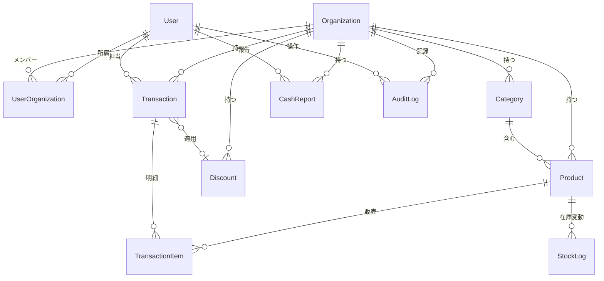

# 光芒祭POSシステム - DB設計書

**作成日:** 2026年2月3日  
**版数:** 1.0

---

## 1. ER図（概要）



---

## 2. 列挙型（Enum）

### 2.1 Role（ユーザー権限）

| `ADMIN` | 団体管理者（リーダー） |
| `STAFF` | 一般スタッフ |
| `PENDING` | 承認待ち（機能制限状態） |

### 2.2 UserStatus（アカウント状態）

| 値 | 説明 |
|----|------|
| `ACTIVE` | 通常利用可能 |
| `SUSPENDED` | 管理者により停止 |
| `DEACTIVATED` | 退会済み |

### 2.3 TransactionStatus（取引状態）

| 値 | 説明 |
|----|------|
| `PENDING` | 支払い待ち（在庫確保済み） |
| `COMPLETED` | 完了 |
| `CANCELLED` | キャンセル（在庫戻し） |
| `REFUNDED` | 返金済み |

### 2.4 PaymentMethod（支払方法）

| 値 | 説明 |
|----|------|
| `CASH` | 現金 |
| `PAYPAY` | PayPay |

### 2.5 StockChangeReason（在庫変動理由）

| 値 | 説明 |
|----|------|
| `SALE` | 販売による減算 |
| `REPLENISH` | 補充 |
| `ADJUSTMENT` | 棚卸し等の手動修正 |
| `RETURN` | 返品による戻し |

### 2.6 DiscountType（割引種別）

| 値 | 説明 |
|----|------|
| `FIXED` | 定額（例: 100円引き） |
| `PERCENT` | 定率（例: 10%オフ） |

### 2.7 DiscountTargetType（割引適用対象）

| 値 | 説明 |
|----|------|
| `ORDER_TOTAL` | 注文全体 |
| `SPECIFIC_PROD` | 特定の商品 |
| `CATEGORY` | 特定のカテゴリ（将来拡張用） |

### 2.8 DiscountConditionType（割引適用条件）

| 値 | 説明 |
|----|------|
| `NONE` | 無条件 |
| `MIN_QUANTITY` | 最低個数（例: 3個以上） |
| `MIN_AMOUNT` | 最低金額（例: 1000円以上） |

### 2.9 DiscountTriggerType（適用トリガー）

| 値 | 説明 |
|----|------|
| `MANUAL` | 手動選択 |
| `AUTO` | 自動適用 |

---

## 3. テーブル定義

### 3.1 User（ユーザー）

| カラム名 | 型 | 制約 | 説明 |
|----------|-----|------|------|
| id | UUID | PK | ユーザーID |
| email | String | UNIQUE | メールアドレス |
| passwordHash | String | NOT NULL | パスワードハッシュ |
| name | String | NOT NULL | 表示名 |
| status | UserStatus | DEFAULT: ACTIVE | アカウント状態 |
| isSystemAdmin | Boolean | DEFAULT: false | 実行委員会フラグ |
| createdAt | DateTime | DEFAULT: now() | 作成日時 |

**リレーション:**
- `organizations` → UserOrganization（1:N）
- `transactions` → Transaction（1:N）
- `cashReports` → CashReport（1:N）
- `auditLogs` → AuditLog（1:N）

---

### 3.2 Organization（団体）

| カラム名 | 型 | 制約 | 説明 |
|----------|-----|------|------|
| id | UUID | PK | 団体ID |
| name | String | NOT NULL | 団体名 |
| inviteCode | String | UNIQUE | 招待コード |
| isActive | Boolean | DEFAULT: true | 有効フラグ |
| createdAt | DateTime | DEFAULT: now() | 作成日時 |

**リレーション:**
- `members` → UserOrganization（1:N）
- `categories` → Category（1:N）
- `products` → Product（1:N）
- `discounts` → Discount（1:N）
- `transactions` → Transaction（1:N）
- `cashReports` → CashReport（1:N）
- `auditLogs` → AuditLog（1:N）

---

### 3.3 UserOrganization（所属・権限）

| カラム名 | 型 | 制約 | 説明 |
|----------|-----|------|------|
| userId | UUID | PK (複合) | ユーザーID |
| organizationId | UUID | PK (複合) | 団体ID |
| role | Role | DEFAULT: STAFF | 権限 |

> **複合主キー**: `(userId, organizationId)`

---

### 3.4 Category（商品カテゴリ）

| カラム名 | 型 | 制約 | 説明 |
|----------|-----|------|------|
| id | UUID | PK | カテゴリID |
| organizationId | UUID | FK | 団体ID |
| name | String | NOT NULL | カテゴリ名（例: フード） |
| sortOrder | Int | DEFAULT: 0 | 表示順 |

---

### 3.5 Product（商品）

| カラム名 | 型 | 制約 | 説明 |
|----------|-----|------|------|
| id | UUID | PK | 商品ID |
| organizationId | UUID | FK | 団体ID |
| categoryId | UUID | FK (NULL可) | カテゴリID |
| name | String | NOT NULL | 商品名 |
| price | Int | NOT NULL | 単価（円） |
| stock | Int | DEFAULT: 0 | 在庫数 |
| isActive | Boolean | DEFAULT: true | 販売中フラグ |

---

### 3.6 StockLog（在庫変動履歴）

| カラム名 | 型 | 制約 | 説明 |
|----------|-----|------|------|
| id | UUID | PK | ログID |
| productId | UUID | FK | 商品ID |
| changeAmount | Int | NOT NULL | 変動量（正負） |
| reason | StockChangeReason | NOT NULL | 変動理由 |
| createdAt | DateTime | DEFAULT: now() | 日時 |

---

### 3.7 Discount（割引設定）

| カラム名 | 型 | 制約 | 説明 |
|----------|-----|------|------|
| id | UUID | PK | 割引ID |
| organizationId | UUID | FK | 団体ID |
| name | String | NOT NULL | 割引名（例: タイムセール） |
| type | DiscountType | NOT NULL | 種別（定額/定率） |
| value | Int | NOT NULL | 値（円または%） |
| targetType | DiscountTargetType | DEFAULT: ORDER_TOTAL | 適用対象 |
| targetProductId | UUID | FK (NULL可) | 対象商品ID |
| conditionType | DiscountConditionType | DEFAULT: NONE | 適用条件 |
| conditionValue | Int | DEFAULT: 0 | 条件閾値 |
| triggerType | DiscountTriggerType | DEFAULT: MANUAL | 適用トリガー |
| validFrom | DateTime | NULL可 | 開始日時 |
| validTo | DateTime | NULL可 | 終了日時 |
| priority | Int | DEFAULT: 0 | 優先度 |
| isActive | Boolean | DEFAULT: true | 有効フラグ |

---

### 3.8 Transaction（取引ヘッダー）

| カラム名 | 型 | 制約 | 説明 |
|----------|-----|------|------|
| id | UUID | PK | 取引ID |
| organizationId | UUID | FK | 団体ID |
| userId | UUID | FK | 操作担当者ID |
| totalAmount | Int | NOT NULL | 合計金額 |
| discountAmount | Int | DEFAULT: 0 | 割引額 |
| discountId | UUID | FK (NULL可) | 適用割引ID |
| paymentMethod | PaymentMethod | NOT NULL | 支払方法 |
| paypayOrderId | String | UNIQUE (NULL可) | PayPay注文ID |
| status | TransactionStatus | DEFAULT: PENDING | 状態 |
| createdAt | DateTime | DEFAULT: now() | 日時 |

---

### 3.9 TransactionItem（取引明細）

| カラム名 | 型 | 制約 | 説明 |
|----------|-----|------|------|
| id | UUID | PK | 明細ID |
| transactionId | UUID | FK | 取引ID |
| productId | UUID | FK | 商品ID |
| quantity | Int | NOT NULL | 数量 |
| unitPrice | Int | NOT NULL | 販売時点の単価（割引後） |
| originalPrice | Int | NOT NULL | 定価（割引前） |
| discountAmount | Int | DEFAULT: 0 | 1個あたりの割引額 |
| appliedDiscountId | UUID | FK (NULL可) | 適用割引ID |

> **重要**: `unitPrice` は販売時点の価格を固定保存。マスター価格変更の影響を受けない。

---

### 3.10 CashReport（レジ締め報告）

| カラム名 | 型 | 制約 | 説明 |
|----------|-----|------|------|
| id | UUID | PK | レポートID |
| organizationId | UUID | FK | 団体ID |
| userId | UUID | FK | 報告者ID |
| openingCash | Int | NOT NULL | 準備金（お釣り用） |
| theoreticalSales | Int | NOT NULL | システム上の現金売上 |
| actualCash | Int | NOT NULL | 実際の現金 |
| difference | Int | NOT NULL | 過不足 |
| createdAt | DateTime | DEFAULT: now() | 日時 |

---

### 3.11 AuditLog（監査ログ）

| カラム名 | 型 | 制約 |説明	|
|----------|-----|------|------|
| id | UUID | PK | ログID |
| organizationId | UUID | FK (NULL可) | 団体ID |
| userId | UUID | FK | 操作者ID |
| category | String | NOT NULL | 操作カテゴリ (AUTH, PRODUCT, DISCOUNT, ROLE, TRANSACTION, ORG, SYSTEM) |
| action | String | NOT NULL | 操作種別 |
| targetId | UUID | NULL可 | 操作対象ID |
| payload | JSON | NULL可 | 変更前後の値等 |
| isSystemAdminAction | Boolean | DEFAULT: false | システム管理者操作フラグ |
| createdAt | DateTime | DEFAULT: now() | 日時 |

**action の例:**
- `PRICE_CHANGE` - 価格変更
- `USER_SUSPEND` - ユーザー停止
- `PRODUCT_CREATE` - 商品作成
- `REFUND` - 返金処理

---

### 3.12 SystemSetting（システム設定）

| カラム名 | 型 | 制約 | 説明 |
|----------|-----|------|------|
| id | String | PK | "singleton"固定 |
| eventDate | DateTime | NULL可 | 開催日 |
| eventStartTime | String | NULL可 | 開始時刻（例: "10:00"） |
| eventEndTime | String | NULL可 | 終了時刻（例: "17:00"） |
| systemEnabled | Boolean | DEFAULT: true | システム有効フラグ（false=緊急停止） |
| paypayEnabled | Boolean | DEFAULT: true | PayPay決済有効フラグ |
| paypayQrTimeout | Int | DEFAULT: 300 | QRタイムアウト秒数 |
| updatedAt | DateTime | @updatedAt | 更新日時 |

> **注意**: PayPay API認証情報（API Key, Secret等）は環境変数（.env）で管理

---

## 4. Prismaスキーマ

```prisma
datasource db {
  provider = "postgresql"
  url      = env("DATABASE_URL")
}

generator client {
  provider = "prisma-client-js"
}

enum Role {
  ADMIN
  STAFF
  PENDING
}

enum UserStatus {
  ACTIVE
  SUSPENDED
  DEACTIVATED
}

enum TransactionStatus {
  PENDING
  COMPLETED
  CANCELLED
  REFUNDED
}

enum PaymentMethod {
  CASH
  PAYPAY
}

enum StockChangeReason {
  SALE
  REPLENISH
  ADJUSTMENT
  RETURN
}

enum DiscountType {
  FIXED
  PERCENT
}

enum DiscountTargetType {
  ORDER_TOTAL
  SPECIFIC_PROD
  CATEGORY
}

enum DiscountConditionType {
  NONE
  MIN_QUANTITY
  MIN_AMOUNT
}

enum DiscountTriggerType {
  MANUAL
  AUTO
}

model User {
  id            String             @id @default(uuid())
  email         String             @unique
  passwordHash  String
  name          String
  status        UserStatus         @default(ACTIVE)
  isSystemAdmin Boolean            @default(false)
  organizations UserOrganization[]
  transactions  Transaction[]
  cashReports   CashReport[]
  auditLogs     AuditLog[]
  createdAt     DateTime           @default(now())
}

model Organization {
  id           String             @id @default(uuid())
  name         String
  inviteCode   String             @unique
  isActive     Boolean            @default(true)
  members      UserOrganization[]
  categories   Category[]
  products     Product[]
  discounts    Discount[]
  transactions Transaction[]
  cashReports  CashReport[]
  auditLogs    AuditLog[]
  createdAt    DateTime           @default(now())
}

model UserOrganization {
  userId         String
  organizationId String
  role           Role         @default(STAFF)
  user           User         @relation(fields: [userId], references: [id])
  organization   Organization @relation(fields: [organizationId], references: [id])

  @@id([userId, organizationId])
}

model Category {
  id             String       @id @default(uuid())
  organizationId String
  name           String
  sortOrder      Int          @default(0)
  organization   Organization @relation(fields: [organizationId], references: [id])
  products       Product[]
}

model Product {
  id             String            @id @default(uuid())
  organizationId String
  categoryId     String?
  name           String
  price          Int
  stock          Int               @default(0)
  isActive       Boolean           @default(true)
  organization   Organization      @relation(fields: [organizationId], references: [id])
  category       Category?         @relation(fields: [categoryId], references: [id])
  items          TransactionItem[]
  stockLogs      StockLog[]
}

model StockLog {
  id           String            @id @default(uuid())
  productId    String
  changeAmount Int
  reason       StockChangeReason
  product      Product           @relation(fields: [productId], references: [id])
  createdAt    DateTime          @default(now())
}

model Discount {
  id              String                @id @default(uuid())
  organizationId  String
  name            String
  type            DiscountType
  value           Int
  targetType      DiscountTargetType    @default(ORDER_TOTAL)
  targetProductId String?
  conditionType   DiscountConditionType @default(NONE)
  conditionValue  Int                   @default(0)
  triggerType     DiscountTriggerType   @default(MANUAL)
  validFrom       DateTime?
  validTo         DateTime?
  priority        Int                   @default(0)
  isActive        Boolean               @default(true)
  organization    Organization          @relation(fields: [organizationId], references: [id])
  product         Product?              @relation(fields: [targetProductId], references: [id])
  transactions    Transaction[]
  transactionItems TransactionItem[]
}

model Transaction {
  id             String            @id @default(uuid())
  organizationId String
  userId         String
  totalAmount    Int
  discountAmount Int               @default(0)
  discountId     String?
  paymentMethod  PaymentMethod
  paypayOrderId  String?           @unique
  status         TransactionStatus @default(PENDING)
  organization   Organization      @relation(fields: [organizationId], references: [id])
  user           User              @relation(fields: [userId], references: [id])
  discount       Discount?         @relation(fields: [discountId], references: [id])
  items          TransactionItem[]
  createdAt      DateTime          @default(now())
}

model TransactionItem {
  id                String      @id @default(uuid())
  transactionId     String
  productId         String
  quantity          Int
  unitPrice         Int
  originalPrice     Int
  discountAmount    Int         @default(0)
  appliedDiscountId String?
  transaction       Transaction @relation(fields: [transactionId], references: [id])
  product           Product     @relation(fields: [productId], references: [id])
  discount          Discount?   @relation(fields: [appliedDiscountId], references: [id])
}

model CashReport {
  id               String       @id @default(uuid())
  organizationId   String
  userId           String
  openingCash      Int
  theoreticalSales Int
  actualCash       Int
  difference       Int
  organization     Organization @relation(fields: [organizationId], references: [id])
  user             User         @relation(fields: [userId], references: [id])
  createdAt        DateTime     @default(now())
}

model AuditLog {
  id                  String        @id @default(uuid())
  organizationId      String?
  userId              String
  category            String
  action              String
  targetId            String?
  payload             Json?
  isSystemAdminAction Boolean       @default(false)
  createdAt           DateTime      @default(now())
  organization        Organization? @relation(fields: [organizationId], references: [id])
  user                User          @relation(fields: [userId], references: [id])

  @@index([organizationId, createdAt])
  @@index([category])
  @@index([userId])
}

model SystemSetting {
  id              String    @id @default("singleton")
  eventDate       DateTime?
  eventStartTime  String?
  eventEndTime    String?
  systemEnabled   Boolean   @default(true)
  paypayEnabled   Boolean   @default(true)
  paypayQrTimeout Int       @default(300)
  updatedAt       DateTime  @updatedAt
}
```
