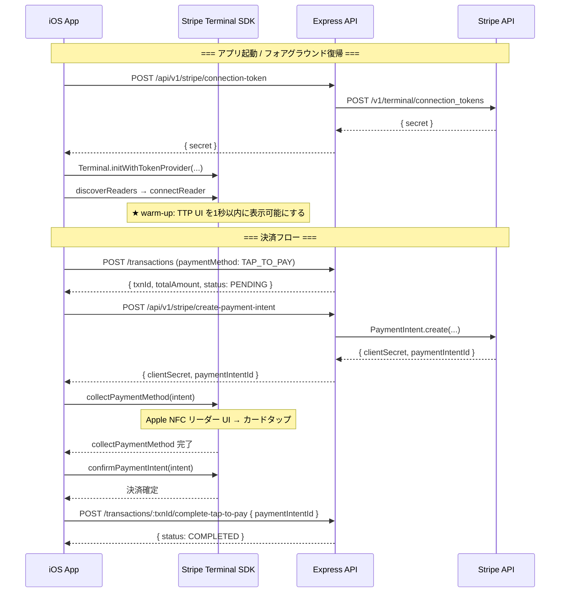
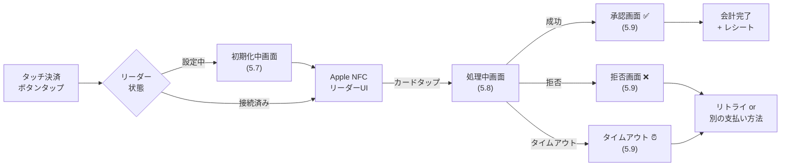
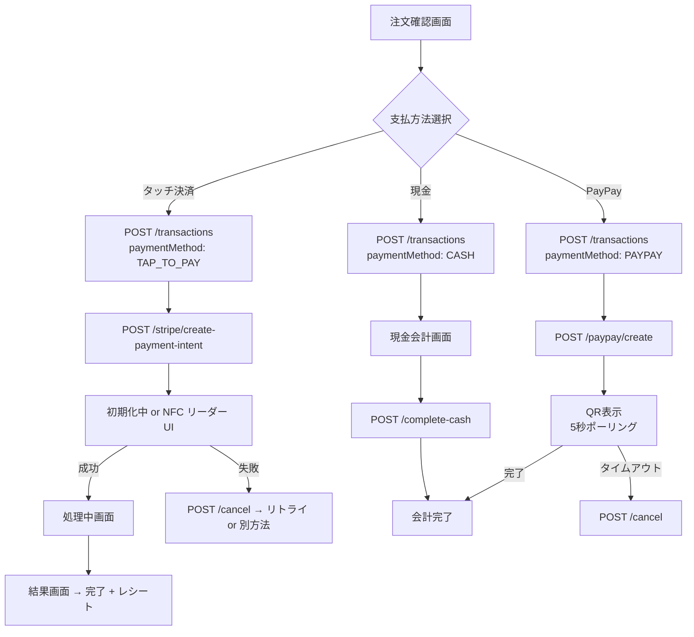
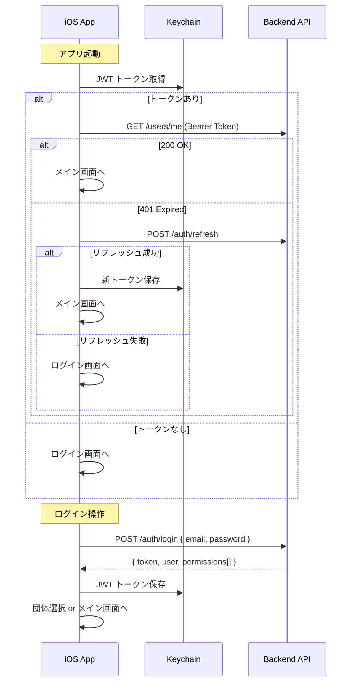
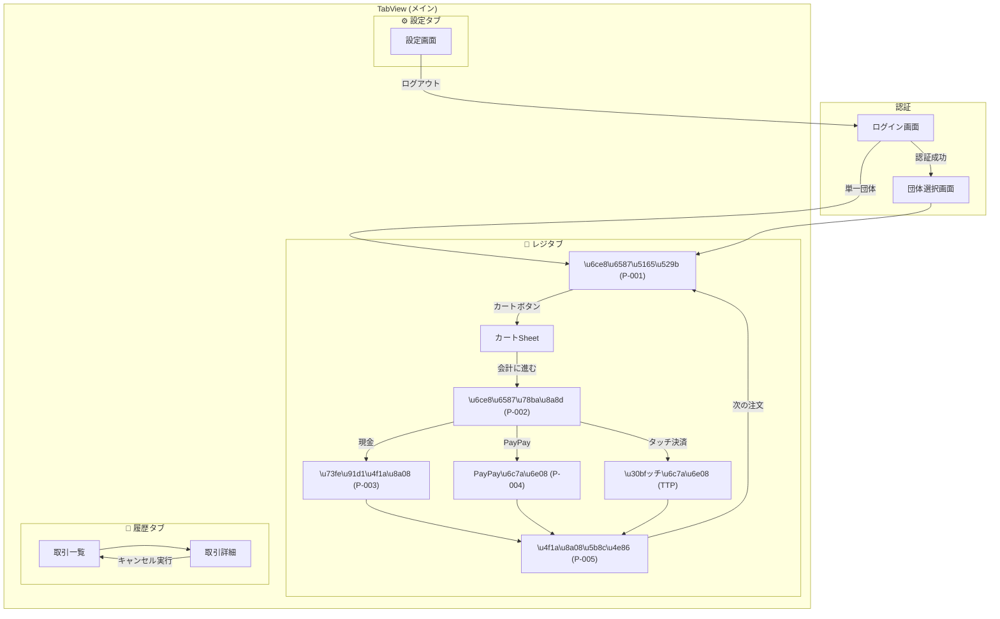

# iOS ネイティブ POS アプリ 詳細仕様書 v3.2

**作成日:** 2026年3月15日
**版数:** 3.2（`enable_tap_to_pay` 権限設計、Stripe Location 確定）

---

## 1. アーキテクチャ概要

### 1.1 技術スタック

| 項目 | 技術・バージョン |
|------|-----------------|
| **言語** | Swift 5.10+ |
| **UIフレームワーク** | SwiftUI (iOS 17.0+) |
| **非同期処理** | Swift Concurrency (async/await, Actor) |
| **ローカルキャッシュ** | SwiftData |
| **ネットワーク** | URLSession + async/await |
| **決済SDK** | Stripe Terminal iOS SDK ~5.x (Swift Package Manager) |
| **認証情報保存** | Keychain Services (via KeychainAccess ライブラリ推奨) |
| **依存管理** | Swift Package Manager (SPM) |
| **最低OS** | **iOS 17.0** |

### 1.2 SwiftData を採用する利点

| 利点 | 詳細 |
|------|------|
| **SwiftUI との統合** | `@Query` でビューとデータが自動同期。データ変更時にUIが自動更新 |
| **型安全なモデル定義** | `@Model` マクロで Swift クラスをそのままDBモデルとして使用可能 |
| **Swift Concurrency 対応** | `ModelActor` でバックグラウンドスレッド安全なデータ操作 |
| **自動マイグレーション** | モデル変更を自動検知してスキーマ更新 |
| **本アプリでの活用** | 商品マスタ・カテゴリ・割引のキャッシュ。オフライン時フォールバック |

### 1.3 アーキテクチャパターン: MVVM

```
┌──────────────┐    ┌──────────────┐    ┌──────────────┐
│    View      │◄──►│  ViewModel   │◄──►│   Service    │
│  (SwiftUI)   │    │ @Observable  │    │  (API/SDK)   │
└──────────────┘    └──────────────┘    └──────────────┘
                           │                   │
                    ┌──────▼──────┐   ┌────────┴────────┐
                    │  SwiftData  │   │                 │
                    │ ModelContext │   ├─ APIClient      │
                    └─────────────┘   ├─ StripeTerminal │
                                      └─────────────────┘
```

### 1.4 プロジェクトディレクトリ構成

```
apps/ios-pos/
├── koubou-fes-POS.xcodeproj
├── koubou-fes-POS/
│   ├── App/
│   │   ├── KoubouFesPOSApp.swift
│   │   └── AppDelegate.swift              # Stripe Terminal 初期化 + warm-up
│   ├── Models/
│   │   ├── User.swift
│   │   ├── Organization.swift
│   │   ├── Product.swift                  # @Model (SwiftData)
│   │   ├── Category.swift                 # @Model (SwiftData)
│   │   ├── Discount.swift                 # @Model (SwiftData)
│   │   ├── Transaction.swift
│   │   ├── CartItem.swift
│   │   └── APIResponse.swift
│   ├── ViewModels/
│   │   ├── AuthViewModel.swift
│   │   ├── POSViewModel.swift
│   │   ├── PaymentViewModel.swift
│   │   ├── TransactionHistoryViewModel.swift
│   │   └── SettingsViewModel.swift
│   ├── Views/
│   │   ├── Auth/
│   │   │   ├── LoginView.swift
│   │   │   └── OrganizationSelectView.swift
│   │   ├── POS/
│   │   │   ├── POSTabView.swift
│   │   │   ├── OrderInputView.swift       # P-001
│   │   │   ├── CartSheetView.swift
│   │   │   ├── OrderConfirmView.swift     # P-002
│   │   │   ├── CashPaymentView.swift      # P-003
│   │   │   ├── PayPayPaymentView.swift    # P-004
│   │   │   ├── TapToPayView.swift         # TTP 決済画面
│   │   │   ├── TapToPayInitializingView.swift  # TTP 初期化中
│   │   │   ├── TapToPayProcessingView.swift    # TTP 処理中
│   │   │   ├── TapToPayResultView.swift        # TTP 結果表示
│   │   │   ├── PaymentCompleteView.swift  # P-005
│   │   │   └── DiscountSheetView.swift
│   │   ├── TapToPayOnboarding/                 # ★追加: TTP教育・有効化
│   │   │   ├── TTPSplashView.swift             # スプラッシュ（ヒーローバナー）
│   │   │   ├── TTPEducationView.swift          # 教育スクリーン
│   │   │   └── TTPTryItOutView.swift           # 「試してみよう」画面
│   │   ├── History/
│   │   │   ├── TransactionListView.swift
│   │   │   └── TransactionDetailView.swift
│   │   ├── Receipt/                            # ★追加: デジタルレシート
│   │   │   └── DigitalReceiptView.swift
│   │   └── Settings/
│   │       └── SettingsView.swift              # TTP有効化 + 教育リンク含む
│   ├── Services/
│   │   ├── APIClient.swift
│   │   ├── AuthService.swift
│   │   ├── ProductService.swift
│   │   ├── TransactionService.swift
│   │   ├── TapToPayService.swift
│   │   └── CacheService.swift
│   ├── Utilities/
│   │   ├── KeychainHelper.swift
│   │   ├── HapticManager.swift
│   │   ├── Constants.swift
│   │   └── Extensions/
│   │       ├── Color+Theme.swift
│   │       └── View+Modifiers.swift
│   ├── Resources/
│   │   ├── Assets.xcassets
│   │   └── Localizable.strings            # 日本語ローカライズ含む
│   └── Entitlements/
│       └── koubou-fes-POS.entitlements
└── koubou-fes-POSTests/
```

### 1.5 Info.plist / ビルド設定 (Apple 要件 1.1-1.3)

| 設定項目 | 値 | Apple 要件 |
|---------|-----|-----------|
| `UIRequiredDeviceCapabilities` | `iphone-ipad-minimum-performance-a12` | 1.3 |
| `NSLocationWhenInUseUsageDescription` | 「決済を受け付けるには、位置情報へのアクセスが必要です。」 | Stripe SDK |
| `NSBluetoothAlwaysUsageDescription` | 「カードリーダーへの接続に使用します。」 | Stripe SDK |
| `NSBluetoothPeripheralUsageDescription` | 「カードリーダーへの接続に使用します。」 | App Store 検証 |
| Tap to Pay エンタイトルメント | `com.apple.developer.proximity-reader.payment.acceptance = true` | 申請済み |

---

## 2. Tap to Pay on iPhone 詳細仕様

### 2.1 日本語ローカライズ名称 (Apple Marketing Guidelines)

| 形式 | 表記 | 使用箇所 |
|------|------|---------|
| **正式名称** | **iPhoneのタッチ決済** | スプラッシュ、教育画面、設定 |
| **短縮名称** | **タッチ決済** | ボタンラベル、チェックアウト画面 |
| **英語名** | Tap to Pay on iPhone | コード内、ログ |

### 2.2 SDK 統合 & warm-up (Apple 要件 1.5, 5.6)



**warm-up の実装:**
```swift
// AppDelegate.swift / ScenePhase 監視
// アプリ起動時およびフォアグラウンド復帰時に実行
func warmUpTapToPay() {
    // Stripe Terminal SDK のリーダー検出・接続を
    // バックグラウンドで事前実行し、NFC リーダー UI の
    // 表示レイテンシを 1秒以内に抑える (Apple 要件 5.6)
    tapToPayService.discoverAndConnect(locationId: stripeLocationId)
}
```

### 2.3 PaymentIntent

> **PaymentIntent** は Stripe の決済オブジェクトで、1回の決済を一意に管理します。

| 項目 | 説明 |
|------|------|
| **ID 例** | `pi_3Oxx123abc456def` |
| **clientSecret** | SDK に渡す認証キー |
| **保存理由** | 返金時に必要 / Stripe Dashboard 照合 / トラブル調査 |

Transaction テーブルに `stripePaymentIntentId` として保存。

### 2.3.1 TapToPayService クラス設計

```swift
/// Stripe Terminal SDK のラッパーサービス
@Observable
final class TapToPayService: NSObject {
    
    enum ConnectionStatus {
        case disconnected
        case discovering
        case connecting
        case connected
        case error(String)
    }
    
    enum PaymentStatus {
        case idle
        case collectingPayment    // NFCリーダーUI表示中
        case processing           // 決済確認中
        case completed(String)    // PaymentIntent ID
        case failed(String)       // エラーメッセージ
        case cancelled
    }
    
    var connectionStatus: ConnectionStatus = .disconnected
    var paymentStatus: PaymentStatus = .idle
    var setupProgress: Float = 0.0     // ソフトウェア更新進捗
    var isReaderReady: Bool = false
    
    // リーダー検出・接続
    func discoverAndConnect(locationId: String) async throws
    
    // 決済の実行（PaymentIntent の clientSecret を受け取って実行）
    func collectPayment(clientSecret: String) async throws -> String  // returns paymentIntentId
    
    // 決済キャンセル
    func cancelPayment() async throws
    
    // 切断
    func disconnect() async throws
}
```

### 2.4 Stripe Location

> **Stripe Location** は決済が行われた店舗・場所を表すオブジェクト。NFC リーダー UI に `display_name` が表示される。

**決定: イベント全体で1つの Location を使用する。**

| 項目 | 値 |
|------|----|
| `display_name` | `光芒祭 2026` |
| 住所 | イベント会場の住所 |
| 管理方法 | `SystemSetting.stripeLocationId` に保存 |

顧客のカード明細・NFC リーダー UI に「光芒祭 2026」と表示される。各団体名はアプリ内の会計完了画面・レシートに表示する。

### 2.5 T&C（利用規約）の権限制御 (Apple 要件 3.8)

> [!IMPORTANT]
> **Apple 要件: T&C は「authorized party（権限を持つ担当者）」のみが同意可能。**
> 専用の `enable_tap_to_pay` Permission でこれを実現する。Admin への一時昇格は不要。

#### `enable_tap_to_pay` Permission の設計

既存の `Permission` / `ServiceRole` / `RolePermission` テーブルに、新しい Permission コードを追加する。**スキーマ変更は不要**（レコードの追加のみ）。

```sql
-- Permission テーブルに1レコード追加
INSERT INTO "Permission" (id, code, name, description, category)
VALUES (gen_random_uuid(), 'enable_tap_to_pay',
        'タッチ決済の有効化', 'iPhoneのタッチ決済のT&C同意・有効化操作を行える', 'PAYMENT');
```

#### デフォルトの権限割り当て

| ロール | `enable_tap_to_pay` | 備考 |
|--------|-------------------|------|
| `isSystemAdmin` | ✅ 常に付与 | 全団体で有効化可能 |
| `ORG_ADMIN` | ✅ デフォルトで付与 | 自団体のみ有効化可能 |
| `STAFF` | ❌ デフォルトなし | Web管理画面で ORG_ADMIN が個別付与可能 |

#### iOS アプリ側の動作

| 権限の有無 | タッチ決済ボタンタップ時 |
|-----------|----------------------|
| `enable_tap_to_pay` **あり** | → T&C 有効化フローを開始（Stripe SDK が Apple ID サインイン→同意を処理） |
| `enable_tap_to_pay` **なし** | → アラート:「タッチ決済の有効化には権限が必要です。管理者に付与を依頼してください。」 |

**実装:**
- ログインレスポンスの `permissions` 配列に `enable_tap_to_pay` が含まれるか確認
- 含まれる場合のみ `connectReader` を呼び出して T&C フローを開始
- T&C 受諾ステータスはローカル変数に保存せず、常に SDK / Apple API から取得（要件 1.6）

### 2.6 接続管理・リカバリ

| イベント | 対応 |
|---------|------|
| アプリ起動 / フォアグラウンド復帰 | **warm-up**: リーダー検出・接続を自動実行 (要件 1.5) |
| アプリがバックグラウンドへ | リーダー自動切断 → フォアグラウンド復帰時に自動再接続 |
| ネットワーク切断 | バナー表示 + 自動再接続試行 |
| 再接続失敗 | アラート → 手動再接続 or 現金/PayPay に切り替え |
| ソフトウェア更新 | プログレスインジケーター表示 (要件 3.9.1) |
| `osVersionNotSupported` | 「iOSを最新バージョンに更新してください」メッセージ表示 (要件 1.4) |

> [!NOTE]
> **24時間内に同一デバイスで使用できる Stripe アカウントは最大 3つ**
> この制限に達した場合は `SCPErrorTapToPayReaderMerchantBlocked` エラーが発生する。別端末の使用を案内する。

---

## 3. TTP オンボーディング・教育フロー (Apple 要件 2.x, 3.x, 4.x)

### 3.1 初回起動スプラッシュ (要件 3.1, 3.2, 6.2)

アプリ初回起動時（または TTP 未有効化時）にフルスクリーンモーダルを表示:

```
┌──────────────────────────────┐
│                              │
│       📱💳                   │
│                              │
│   iPhoneのタッチ決済          │
│   が利用できます              │
│                              │
│   iPhoneだけでクレジット      │
│   カード・電子マネーの        │
│   お支払いを受け付けられます   │
│                              │
│   対応: Visa / Mastercard    │
│   American Express           │
│   Apple Pay / Google Pay     │
│                              │
│ ┌──────────────────────────┐ │
│ │    タッチ決済を始める     │ │  ← ORG_ADMIN のみ有効化フローへ
│ └──────────────────────────┘ │
│                              │
│       あとで設定する          │  ← 閉じる
│                              │
└──────────────────────────────┘
```

### 3.2 教育画面フロー (要件 4.2, 4.5, 4.6)

T&C 同意後に表示される教育スクリーン（スワイプ式の複数ページ）:

```
┌──────────────────────────────┐
│                              │
│  📖 iPhoneのタッチ決済       │
│     の使い方                 │
│                              │
│  ── ページ 1/3 ──            │
│                              │
│     💳 → 📱                  │
│                              │
│  お客様のクレジットカードを   │
│  iPhoneの上部にかざして      │
│  もらいます                  │
│                              │
│  • 非接触型カード対応         │
│  • Visa / Mastercard / Amex  │
│                              │
│        ● ○ ○                │
│                              │
│ ┌──────────────────────────┐ │
│ │          次 へ            │ │
│ └──────────────────────────┘ │
└──────────────────────────────┘
```

**ページ構成:**
1. **非接触型カードの受付方法** (要件 4.5) — カードの向き・位置の説明
2. **Apple Pay / デジタルウォレットの受付** (要件 4.6) — Apple Pay / Google Pay 対応の説明
3. **決済結果の確認方法** — 承認/拒否時の対応

### 3.3 「試してみよう」画面 (要件 3.9)

教育完了後に表示:
```
┌──────────────────────────────┐
│                              │
│        ✅ 準備完了!          │
│                              │
│  タッチ決済の設定が           │
│  完了しました                │
│                              │
│  レジ画面から                │
│  「タッチ決済」を             │
│  お試しください              │
│                              │
│ ┌──────────────────────────┐ │
│ │    レジ画面へ進む         │ │
│ └──────────────────────────┘ │
└──────────────────────────────┘
```

### 3.4 設定画面から TTP を有効化・教育にアクセス (要件 3.6, 4.3)

設定タブに以下を追加:

```
┌──────────────────────────────┐
│  ⚙️ 設定                     │
├──────────────────────────────┤
│                              │
│  👤 ユーザー情報              │
│     田中太郎                  │
│     staff@example.com        │
│                              │
│  🏢 所属団体                  │
│     電子情報工学科2年         │
│                              │
│  ── タッチ決済 ──             │
│                              │
│  ⦿ iPhoneのタッチ決済        │
│     [有効化する]    ← (Admin のみ表示) │
│     状態: 有効 ✅             │
│                              │
│  📖 タッチ決済の使い方        │  ← 教育画面を再表示 (要件 4.3)
│                              │
│  ──────────────────────────  │
│                              │
│  🔒 生体認証ロック [切替]    │
│  🌙 ダークモード   [切替]    │
│                              │
│ ┌──────────────────────────┐ │
│ │      ログアウト           │ │
│ └──────────────────────────┘ │
└──────────────────────────────┘
```

### 3.5 マーケティング要件 (要件 6.1, 6.2, 6.3)

| # | 要件 | 実装方法 |
|---|------|---------|
| 6.1 | 対象ユーザーへの告知メール | 運用タスク: TTP 対応リリース時にメール配信 |
| 6.2 | アプリ内スプラッシュ | 3.1 の初回起動スプラッシュで対応 |
| 6.3 | アプリ内プッシュ通知 | アプリ内バナー通知（ローカル通知）で対応 |

> [!CAUTION]
> **マーケティング禁止事項 (Marketing Guidelines):**
> - タッチ決済について**独自の動画・写真を作成してはならない**（Apple 提供素材を使用）
> - マーケティングでは常に正式名称「**iPhoneのタッチ決済**」を使用（「タッチ決済」のみの短縮は禁止）
> - 名称に「**Apple**」を含めてはならない
> - Apple Marketing Guide & Toolkit の素材を使用すること

---

## 4. チェックアウト（決済）フロー (Apple 要件 5.x)

### 4.1 注文確認画面 (P-002) — ボタン配置ルール

> [!IMPORTANT]
> **Apple 要件 5.2**: タッチ決済ボタンは**最上部**に配置し、スクロールなしでアクセス可能にする。
> **Apple 要件 5.3**: ボタンは**グレーアウトしない**。未有効化時はタップで有効化フローを開始する。

```
┌──────────────────────────────┐
│  ←  注文内容の確認            │
├──────────────────────────────┤
│                              │
│  📋 注文内容                  │
│  ┌──────────────────────────┐│
│  │ たこ焼き × 2      ¥600  ││
│  │ 焼きそば × 1      ¥400  ││
│  │ ドリンク × 1      ¥150  ││
│  └──────────────────────────┘│
│                              │
│  小計              ¥1,150   │
│  🏷 セット割引      -¥100   │
│  ──────────────────────────  │
│  合計             ¥1,050    │  ← /calculate API の結果
│                              │
│  [ 🏷 割引を追加 ]           │
│                              │
│  ── お支払い方法 ──           │
│                              │
│  ┌──────────────────────────┐│
│  │  ⦿ タッチ決済             ││  ★ 最上部 (要件 5.2)
│  │    iPhoneのタッチ決済      ││    SF Symbol: wave.3.right.circle
│  └──────────────────────────┘│    グレーアウト禁止 (要件 5.3)
│  ┌──────────────────────────┐│
│  │       💴 現 金            ││  統一デザイン
│  └──────────────────────────┘│
│  ┌──────────────────────────┐│
│  │       📱 PayPay           ││  統一デザイン
│  └──────────────────────────┘│
│                              │
└──────────────────────────────┘
```

**タッチ決済ボタンのタップ時動作:**

| 状態 | ボタン外観 | タップ時の動作 |
|------|----------|-------------|
| **有効化済み + リーダー接続済み** | 通常表示 | → 決済フロー開始 |
| **有効化済み + リーダー未接続** | 通常表示 + サブテキスト「接続中...」 | → 接続試行 → 完了次第決済開始 |
| **未有効化 (Admin)** | 通常表示 | → T&C 有効化フローを開始 (要件 3.7) |
| **未有効化 (STAFF)** | 通常表示 | → 「管理者に連絡してください」アラート (要件 3.8.1) |

### 4.2 決済中の画面遷移 (Apple 要件 5.7, 5.8, 5.9)



#### 初期化中画面 (要件 5.7)

> [!NOTE]
> リーダーの初期化に **300ms 以上**かかる場合に表示する（300ms 未満であれば省略可）。
> warm-up (要件 1.5) により通常は不要だが、初回接続時やソフトウェア更新時に表示される。

```
┌──────────────────────────────┐
│                              │
│        ⏳                    │
│                              │
│   タッチ決済を準備中...       │
│                              │
│   ████████████░░░░  75%     │  ← プログレスインジケーター
│                              │
│   しばらくお待ちください       │
│                              │
│       キャンセル              │
│                              │
└──────────────────────────────┘
```

#### 処理中画面 (要件 5.8)

カード読み取り成功後、Stripe への確認中に表示:

```
┌──────────────────────────────┐
│                              │
│        ⏳                    │
│                              │
│   お支払いを処理中...         │
│                              │
│   ¥1,050                    │
│                              │
│   そのままお待ちください       │
│                              │
└──────────────────────────────┘
```

#### 結果画面 (要件 5.9)

| 結果 | 表示 | Haptics | 次のアクション |
|------|------|---------|-------------|
| **承認** | ✅ 「お支払い完了」 | `.notification(.success)` | → 会計完了画面 (P-005) + レシート |
| **拒否** | ❌ 「お支払いが拒否されました」+ 理由 | `.notification(.error)` | → 「再試行」or「別の方法で支払う」 |
| **タイムアウト** | ⏰ 「タイムアウトしました」 | `.notification(.warning)` | → 「再試行」or「別の方法で支払う」 |

### 4.3 デジタルレシート (Apple 要件 5.10)

> [!IMPORTANT]
> **Apple 要件: 機密性を保ったデジタルレシート送信が必須。**

会計完了画面 (P-005) にレシート送信オプションを追加:

```
┌──────────────────────────────┐
│        会計完了               │
├──────────────────────────────┤
│                              │
│          ✅                  │
│       会計完了                │
│                              │
│   ───────────────────        │
│   たこ焼き ×2        ¥600   │
│   焼きそば ×1        ¥400   │
│   ───────────────────        │
│     合計          ¥1,050    │
│    支払方法   タッチ決済     │
│   ───────────────────        │
│                              │
│  📧 レシートを送信            │
│  ┌──────────────────────────┐│
│  │ 📱 QRコードで表示        ││  ← QRコードでレシートURL表示
│  └──────────────────────────┘│
│                              │
│ ┌──────────────────────────┐ │
│ │      次の注文へ           │ │
│ └──────────────────────────┘ │
│     (3秒後に自動遷移)        │
└──────────────────────────────┘
```

**レシート送信方法:**
1. **QRコード表示** (推奨) — 画面にQRコードを表示し、顧客がスキャンしてレシートページを閲覧
2. 将来拡張: メールアドレス入力 → メール送信

> **実装注:** レシートURL は `GET /api/v1/organizations/:orgId/transactions/:txnId/receipt` で公開レシートページを返すか、簡易的にはアプリ内で情報を QR コード化して表示。

### 4.4 合計金額計算

```
POST /api/v1/organizations/:orgId/transactions/calculate
```

Web版と同様に API を使用。アプリ側では計算ロジックを持たない。

**呼び出しタイミング:**
1. カートSheet の「会計に進む」タップ時
2. 手動割引の追加・削除時
3. 注文確認画面での数量変更時

### 4.5 データ取得タイミング

商品マスタ・カテゴリ・割引は**各会計ごとに再取得**:

| タイミング | 取得するデータ |
|-----------|-------------|
| アプリ起動時 | 商品・カテゴリ・割引（SwiftData にキャッシュ） |
| **会計完了後** | **商品・カテゴリ・割引を再取得** |
| 会計へ進む時 | `/calculate` API で合計金額を計算 |

---

## 5. 決済フロー詳細

### 5.1 決済方法別フロー



### 5.2 返金仕様

- **Tap to Pay 決済**: **Web管理画面からのみ**返金可能
- **iOS アプリ**: PENDING 状態のキャンセルのみ
- COMPLETED 後の返金は Stripe Dashboard で手動処理

### 5.3 エラーハンドリング

| エラー種別 | SDK エラー | 表示 | リカバリ |
|-----------|-----------|---------|---------|
| カード読み取り失敗 | `SCPErrorCardReadError` | 「カードを読み取れませんでした」 | リトライ |
| 決済拒否 | `SCPErrorDeclinedByStripe` | 「お支払いが拒否されました」 | 別の支払い方法 |
| ネットワークエラー | `SCPErrorNotConnectedToInternet` | 「ネットワークに接続されていません」 | Wi-Fi確認 |
| リーダー未接続 | `SCPErrorReaderNotConnected` | 有効化フローまたは再接続 | — |
| ユーザーキャンセル | `SCPErrorCanceled` | 静かにキャンセル | 注文確認に戻る |
| `osVersionNotSupported` | — | 「iOSを最新に更新してください」(要件 1.4) | — |
| デバイス非対応 | `SCPErrorTapToPayNotSupported` | 「このデバイスは非対応です」 | 現金/PayPay案内 |
| 24hアカウント上限 | `SCPErrorTapToPayReaderMerchantBlocked` | 「24時間の上限に達しました」 | 別端末の使用を案内 |

---

## 6. 認証・団体選択

### 6.1 ログイン
- メールアドレス + パスワード
- JWT を Keychain に保存
- Face ID / Touch ID 対応 (要件 1.7 推奨)

### 6.2 認証フロー



### 6.3 団体選択

| ユーザー | 表示 |
|---------|------|
| 通常ユーザー | 所属団体のみ |
| `isSystemAdmin = true` | **全ての団体**（`GET /admin/organizations/list`）|

### 6.4 APIClient 設計

```swift
actor APIClient {
    static let shared = APIClient()
    
    private let baseURL: URL
    private let session: URLSession
    private let keychainHelper: KeychainHelper
    
    // 共通リクエストメソッド
    func request<T: Decodable>(
        _ method: HTTPMethod,
        path: String,
        body: Encodable? = nil,
        queryItems: [URLQueryItem]? = nil
    ) async throws -> T
    
    // JWT トークンの自動付与
    // 401 レスポンス時の自動リフレッシュ（1回）
    // ネットワークエラーの統一ハンドリング
}
```

### 6.5 ローカルキャッシュ戦略

| データ | 保存先 | 更新タイミング |
|-------|--------|--------------|
| 商品マスタ | SwiftData | アプリ起動時・各会計完了後 |
| カテゴリ | SwiftData | 同上 |
| 割引設定 | SwiftData | 同上 |
| カート | `@State` (メモリ) | リアルタイム |
| JWT Token | Keychain | ログイン時 |
| 選択中の団体 | UserDefaults | 団体選択時 |

> SwiftData は API が到達不能な場合のフォールバックキャッシュとして機能する。

---

## 6.6 画面遷移フロー図



---

## 6.7 UI 設計詳細

### カラーシステム

```swift
// Color+Theme.swift
extension Color {
    // プライマリ: 学祭テーマカラー（インディゴ系）
    static let appPrimary = Color(red: 0.29, green: 0.33, blue: 0.85)   // #4A55D9
    static let appPrimaryLight = Color(red: 0.45, green: 0.49, blue: 0.92)
    
    // セマンティックカラー
    static let appSuccess = Color(red: 0.13, green: 0.77, blue: 0.37)   // #22C55E
    static let appWarning = Color(red: 0.96, green: 0.62, blue: 0.04)   // #F59E0B
    static let appError = Color(red: 0.94, green: 0.27, blue: 0.27)     // #EF4444
}
```

### P-001 注文入力画面 SwiftUI 実装ポイント

- カテゴリタブ: `ScrollView(.horizontal)` + `LazyHStack` + `Button`
- 商品グリッド: `LazyVGrid(columns: [GridItem(.flexible()), GridItem(.flexible()), GridItem(.flexible())])`
- カートフローティングボタン: `.safeAreaInset(edge: .bottom)` で画面下部に固定
- カートシート: `.sheet(isPresented:)` + `presentationDetents([.medium, .large])`
- 商品追加アニメ: `.sensoryFeedback(.impact(weight: .light), trigger: cartItemCount)`
---

## 7. セキュリティ

| 項目 | 仕様 |
|------|------|
| JWT | Keychain 保存。UserDefaults 不可 |
| 生体認証 | Face ID ロック解除（オプション） |
| API 通信 | HTTPS 必須 (ATS) |
| Stripe Key | サーバーサイドのみ。`.env` に設定済み |
| Connection Token | SDK 自動管理。キャッシュ・ハードコード不可 |
| T&C ステータス | ローカル保存不可。SDK/Apple API から取得 (要件 1.6) |
| デバッグ情報 | Release ビルドでは `print()` ログを無効化 |

---

## 8. バックエンド追加事項

### 8.1 新規作成

| ファイル | エンドポイント | 用途 |
|---------|-------------|------|
| `src/routes/stripe.ts` | `POST /api/v1/stripe/connection-token` | 接続トークン |
| `src/controllers/stripeController.ts` | 上記 + 下記 | Stripe コントローラー |
| 上記に追加 | `POST /api/v1/stripe/create-payment-intent` | PaymentIntent 作成 |
| 上記に追加 | `POST /api/v1/stripe/cancel-payment-intent` | PaymentIntent キャンセル |
| 新規 | `GET /api/v1/.../transactions/:txnId/receipt` | デジタルレシート (要件 5.10) |

### 8.2 DB スキーマ変更

```prisma
model Transaction {
  // ... 既存 ...
  stripePaymentIntentId  String?   @unique    // 追加
}

model SystemSetting {
  // ... 既存 ...
  tapToPayEnabled        Boolean   @default(true)   // 追加
  stripeLocationId       String?                     // 追加
}
```

### 8.3 Stripe Location 作成

```bash
curl https://api.stripe.com/v1/terminal/locations \
  -u $STRIPE_SECRET_KEY: \
  -d "display_name"="光芒祭 2026" \
  -d "address[line1]"="イベント会場住所" \
  -d "address[city]"="都市名" \
  -d "address[state]"="都道府県" \
  -d "address[country]"="JP" \
  -d "address[postal_code]"="郵便番号"
```

---

## 9. エンタイトルメント審査 & App Store 提出

### 9.1 Publishing エンタイトルメント審査

Publishing エンタイトルメント取得には、以下の資料を Apple に提出する必要がある:

| 提出物 | 形式 | 内容 |
|--------|------|------|
| **オンボーディングフロー動画** | 画面録画 | アカウント作成 → KYC |
| **有効化フロー動画** | 画面録画 | 機能発見 → T&C同意 → 教育画面 → プログレス |
| **チェックアウトフロー動画** | **別デバイスで撮影** | 商品選択 → タッチ決済 → 初期化(>300ms時) → カードタップ → 処理中 → 承認 → レシート |
| UI ワイヤーフレーム | Figma/画像 | 高精細ワイヤーフレームまたは実装済みスクリーンショット |

> [!WARNING]
> **チェックアウトフロー動画は「別のデバイス」で撮影が必須。**
> Tap to Pay の画面はスクリーンレコーディングでキャプチャできないため、
> 2台目の iPhone/iPad で画面を直接撮影する。

### 9.2 App Store 提出ルール

| ルール | 詳細 |
|--------|------|
| **アプリ名に「Tap to Pay on iPhone」を含めない** | Apple Rule 5.2.5 違反。アプリ名・サブタイトルでの使用禁止 |
| エンタイトルメント使用の宣言 | App Store Connect で Tap to Pay エンタイトルメントを宣言 |
| テストアカウント情報 | 審査チームが操作確認できるテスト用ログイン情報を提供 |
| 動画ウォークスルー | 上記 9.1 の動画を App Review Notes に添付 |

### 9.3 審査用動画 (3本必須)

| # | 動画名 | 内容 |
|---|--------|------|
| 1 | **新規ユーザーフロー** | アプリDL → ログイン → スプラッシュ → T&C同意 → 教育画面 → プログレス → 「試してみよう」 |
| 2 | **既存ユーザーフロー** | ログイン → ヒーローバナー発見 → 有効化 → T&C → 設定から教育リソース確認 |
| 3 | **チェックアウトフロー** | 商品選択 → カート → 注文確認 → タッチ決済タップ → NFC UI → 処理中 → 承認 → レシート |

> [!NOTE]
> チェックアウト動画は2台目のデバイスで iPhone の画面を撮影する形式。
> Tap to Pay 画面はスクリーンレコーディングでは記録できない。

---

## 10. リリース戦略

| 方式 | 説明 | 推奨 |
|------|------|------|
| **段階的リリース (Phased Release)** | 7日間かけて徐々にユーザーへ展開。問題発生時に一時停止可能 | ✅ 推奨 |
| **フラグ付きリリース (Flagged Release)** | 手動でリリースタイミングを制御 | — |

> 初回リリースは**段階的リリース**を推奨。イベント前のテスト期間を確保する。


## 11. 確定済み事項まとめ

| 項目 | 決定内容 |
|------|---------|
| **最低 OS** | iOS 17.0 |
| **TTP 有効化権限** | `enable_tap_to_pay` Permission（スキーマ変更不要） |
| **Stripe Location** | イベント全体で1つ（`display_name: 光芒祭 2026`） |
| **PaymentIntent ID** | `Transaction.stripePaymentIntentId` に保存 |
| **返金** | Web管理画面からのみ |
| **Stripe ソースファイル** | 新規作成（`dist/` は参照しない） |
| **タッチ決済ボタン** | Apple HIG 準拠（SF Symbol `wave.3.right.circle`、ラベル「タッチ決済」） |
| **支払いボタン色分け** | 統一デザイン（色分けなし） |
| **データ再取得** | 各会計完了後に商品・カテゴリ・割引を再取得 |
| **合計金額計算** | `/calculate` API を使用 |
