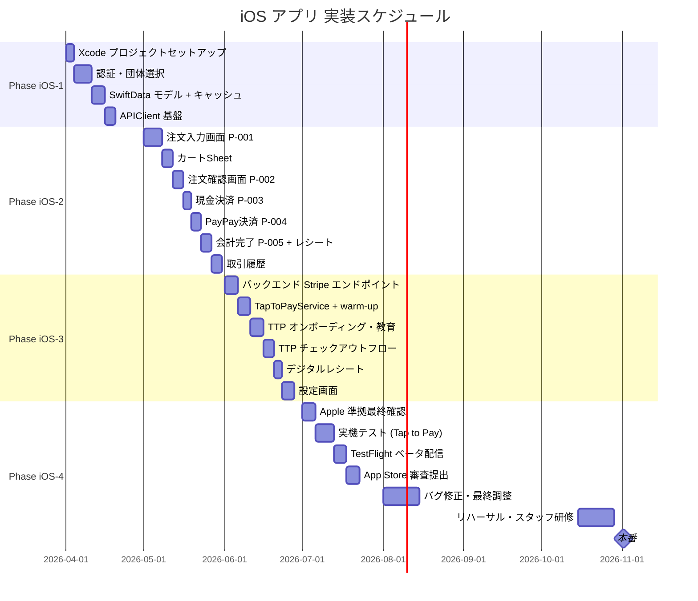

# iOS ネイティブ POS アプリ 実装計画

**作成日:** 2026年3月15日
**対象仕様書:** [iOSapp仕様書_v3.2.md](./iOSapp仕様書_v3.2.md)
**目標:** 2026年11月初旬の学祭本番

---

## 1. 全体スケジュール



---

## 2. フェーズ詳細

### Phase iOS-1: セットアップ & 認証（4月）

**目標:** Xcode プロジェクトを構築し、ログイン〜団体選択が動作する

#### タスク一覧

##### iOS-1-1: Xcode プロジェクト構成

| タスクID | タスク名 | 詳細 | 完了条件 |
|----------|----------|------|----------|
| iOS-1-001 | Xcode プロジェクト作成 | iOS 17.0 ターゲット、SwiftUI、bundle ID 設定 | シミュレーターで起動 |
| iOS-1-002 | SPM 依存追加 | Stripe Terminal iOS SDK、KeychainAccess を追加 | ビルドが通る |
| iOS-1-003 | ディレクトリ構成作成 | 仕様書 §1.4 のフォルダ構造を作成 | フォルダ構造完成 |
| iOS-1-004 | Entitlements 設定 | Tap to Pay エンタイトルメント (`proximity-reader`) | エンタイトルメントファイル完成 |
| iOS-1-005 | Info.plist 設定 | `UIRequiredDeviceCapabilities: a12`、各種 Usage説明 | ビルド警告なし |
| iOS-1-006 | Constants.swift | ベース URL、APIパス定数 | 定数参照可能 |

##### iOS-1-2: APIClient 基盤

| タスクID | タスク名 | 詳細 | 完了条件 |
|----------|----------|------|----------|
| iOS-1-010 | APIClient actor 実装 | URLSession + async/await、共通リクエストメソッド | 任意のエンドポイントを呼べる |
| iOS-1-011 | JWT 自動付与 | Authorization: Bearer ヘッダー自動付与 | 認証 API 呼び出し成功 |
| iOS-1-012 | 401 自動リフレッシュ | トークン期限切れ時に自動リフレッシュ(1回) | リフレッシュ成功後に継続 |
| iOS-1-013 | エラーハンドリング | APIError enum を定義し統一処理 | エラー型が揃う |

##### iOS-1-3: SwiftData モデル

| タスクID | タスク名 | 詳細 | 完了条件 |
|----------|----------|------|----------|
| iOS-1-020 | SwiftData スキーマ設定 | `@Model`: CachedProduct、CachedCategory、CachedDiscount | ModelContainer 起動成功 |
| iOS-1-021 | CacheService 実装 | SwiftData への保存・取得・削除 | CRUD 動作確認 |

##### iOS-1-4: 認証・団体選択

| タスクID | タスク名 | 詳細 | 完了条件 |
|----------|----------|------|----------|
| iOS-1-030 | AuthService 実装 | `POST /auth/login`、`POST /auth/refresh`、Keychain 保存 | JWT 保存・取得成功 |
| iOS-1-031 | AuthViewModel 実装 | 起動時トークン確認 → ログイン画面 or メイン画面 | 分岐が正しく動く |
| iOS-1-032 | LoginView 実装 | メール + パスワード入力、Face ID ボタン | ログイン API 呼び出し成功 |
| iOS-1-033 | Face ID / Touch ID 対応 | LocalAuthentication でアプリロック解除 | 生体認証で再ログイン |
| iOS-1-034 | OrganizationSelectView | 通常ユーザー: 所属団体のみ / isSystemAdmin: 全団体 | 正しい API を呼び分ける |

**完了条件:**
- [ ] `ログイン → 団体選択 → メイン画面（空）` が動作する
- [ ] Keychain からの自動ログインが動作する
- [ ] SwiftData に商品・カテゴリ・割引をキャッシュできる

---

### Phase iOS-2: POS コア機能（5月）

**目標:** 現金・PayPay で会計完了できる

#### タスク一覧

##### iOS-2-1: データ取得・商品サービス

| タスクID | タスク名 | 詳細 | 完了条件 |
|----------|----------|------|----------|
| iOS-2-001 | ProductService 実装 | 商品・カテゴリ・割引の API 取得 → SwiftData 保存 | 起動時にキャッシュされる |
| iOS-2-002 | データ再取得処理 | 会計完了後に再取得 (仕様書 §4.5) | 完了後に最新データ反映 |
| iOS-2-003 | /calculate API 呼び出し | `POST /organizations/:orgId/transactions/calculate` | 合計金額が一致する |

##### iOS-2-2: 注文入力画面 P-001

| タスクID | タスク名 | 詳細 | 完了条件 |
|----------|----------|------|----------|
| iOS-2-010 | OrderInputView 実装 | カテゴリタブ (ScrollView + LazyHStack) | タブ切り替え動作 |
| iOS-2-011 | 商品グリッド | LazyVGrid 3列、角丸カード | 商品タップで追加 |
| iOS-2-012 | SOLD OUT 表示 | `isActive=false` でグレーアウト + バッジ | 非活性商品タップ不可 |
| iOS-2-013 | カートボタン | `.safeAreaInset(edge: .bottom)` 固定 | 商品数・合計を表示 |
| iOS-2-014 | CartSheetView | `.presentationDetents([.medium, .large])` | カート内容表示 |
| iOS-2-015 | 数量変更・削除 | ステッパー、スワイプ削除 | 数量・削除が反映される |
| iOS-2-016 | 触覚フィードバック | `.impact(.light)` (追加) / `.impact(.medium)` (削除) | 振動確認 |

##### iOS-2-3: 注文確認画面 P-002

| タスクID | タスク名 | 詳細 | 完了条件 |
|----------|----------|------|----------|
| iOS-2-020 | OrderConfirmView 実装 | 注文内容・小計・割引・合計表示 | /calculate 結果を表示 |
| iOS-2-021 | 割引シート | 手動割引の追加・削除 | 割引反映後に再計算 |
| iOS-2-022 | 支払方法ボタン配置 | タッチ決済 **最上部** → 現金 → PayPay の順 (要件 5.2) | 順序が仕様通り |
| iOS-2-023 | POSViewModel 実装 | カート状態管理、calculate 呼び出し | 状態が一貫する |

##### iOS-2-4: 現金決済 P-003

| タスクID | タスク名 | 詳細 | 完了条件 |
|----------|----------|------|----------|
| iOS-2-030 | CashPaymentView 実装 | 預かり金入力ボタン、お釣り計算 | 正しくお釣り計算 |
| iOS-2-031 | バリデーション | 預かり金 < 合計時に完了不可 | ボタン無効化 |
| iOS-2-032 | complete-cash API 呼び出し | `POST /transactions/:id/complete-cash` | ステータスが COMPLETED |

##### iOS-2-5: PayPay 決済 P-004

| タスクID | タスク名 | 詳細 | 完了条件 |
|----------|----------|------|----------|
| iOS-2-040 | PayPayPaymentView 実装 | QR コード表示、5秒ポーリング | QR 表示確認 |
| iOS-2-041 | ポーリングタイムアウト | 180秒でキャンセル処理 | タイムアウト後に注文確認へ戻る |

##### iOS-2-6: 会計完了 P-005 & レシート

| タスクID | タスク名 | 詳細 | 完了条件 |
|----------|----------|------|----------|
| iOS-2-050 | PaymentCompleteView 実装 | 完了表示、内訳、支払方法、3秒後自動遷移 | 表示確認 |
| iOS-2-051 | QR コードレシート | `GET /transactions/:txnId/receipt` URL を QR 化 | QR タップでページ表示 |
| iOS-2-052 | 次の注文へ遷移 | カートクリア → P-001 | 再注文フロー確認 |
| iOS-2-053 | `.notification(.success)` | 会計完了時の触覚フィードバック | 振動確認 |

##### iOS-2-7: 取引履歴

| タスクID | タスク名 | 詳細 | 完了条件 |
|----------|----------|------|----------|
| iOS-2-060 | TransactionListView | 一覧表示、日付・金額・支払方法 | 一覧表示確認 |
| iOS-2-061 | TransactionDetailView | 詳細・明細・PENDING キャンセル | キャンセル後にステータス更新 |

**完了条件:**
- [ ] 商品選択 → カート → 注文確認 → 現金会計 → 完了 が一通り動く
- [ ] PayPay QR が表示されポーリングが動作する
- [ ] 取引履歴が表示される
- [ ] 触覚フィードバックが全アクションで動作

---

### Phase iOS-3: Tap to Pay 統合（6月）

**目標:** iPhoneのタッチ決済でカード決済が完了できる（Apple 審査準拠）

> [!IMPORTANT]
> このフェーズは **実機（iPhone XS以降）** が必要。シミュレーターでは Tap to Pay は動作しない。

#### タスク一覧

##### iOS-3-1: バックエンド Stripe エンドポイント（先行）

| タスクID | タスク名 | 詳細 | 完了条件 |
|----------|----------|------|----------|
| iOS-3-001 | `src/routes/stripe.ts` 新規作成 | **`dist/` からではなく新規作成** | ファイル存在 |
| iOS-3-002 | `src/controllers/stripeController.ts` 新規作成 | 同上 | ファイル存在 |
| iOS-3-003 | `POST /api/v1/stripe/connection-token` 実装 | `stripe.terminal.connectionTokens.create()` | connection token 返却 |
| iOS-3-004 | `POST /api/v1/stripe/create-payment-intent` 実装 | `payment_method_types: ['card_present']` | clientSecret 返却 |
| iOS-3-005 | `POST /api/v1/stripe/cancel-payment-intent` 実装 | PaymentIntent キャンセル | キャンセル成功 |
| iOS-3-006 | `GET /.../transactions/:txnId/receipt` 実装 | 公開レシートページ | ページ表示確認 |
| iOS-3-007 | DB マイグレーション | `Transaction.stripePaymentIntentId`、`SystemSetting.tapToPayEnabled/stripeLocationId` | migrate 成功 |
| iOS-3-008 | Permission レコード追加 | `enable_tap_to_pay` を Permission テーブルに INSERT | レコード確認 |
| iOS-3-009 | Stripe Location 作成 | `display_name: 光芒祭 2026`、イベント会場住所 | location_id を `.env` / SystemSetting に保存 |

##### iOS-3-2: TapToPayService + warm-up

| タスクID | タスク名 | 詳細 | 完了条件 |
|----------|----------|------|----------|
| iOS-3-010 | Terminal.initWithTokenProvider | AppDelegate で SDK 初期化 | 初期化成功 |
| iOS-3-011 | TapToPayService 実装 | 仕様書 §2.3.1 のクラス設計通り | ConnectionStatus / PaymentStatus 遷移 |
| iOS-3-012 | discoverAndConnect 実装 | TapToPayDiscoveryConfiguration → connectReader | リーダー接続成功 |
| iOS-3-013 | warm-up 実装 | アプリ起動 / フォアグラウンド復帰時 (ScenePhase) | 起動後 1秒以内に NFC UI が表示可能 |
| iOS-3-014 | `enable_tap_to_pay` 権限チェック | ログインレスポンスの `permissions[]` を確認 | 権限あり/なしで分岐 |

##### iOS-3-3: TTP オンボーディング・教育

| タスクID | タスク名 | 詳細 | 完了条件 |
|----------|----------|------|----------|
| iOS-3-020 | TTPSplashView 実装 | 初回起動時フルスクリーンモーダル (要件 3.1, 3.2) | 表示確認 |
| iOS-3-021 | T&C 権限チェック分岐 | `enable_tap_to_pay` あり → connectReader / なし → アラート | 両パスで動作 |
| iOS-3-022 | Apple T&C 同意フロー | SDK が Apple ID サインイン + 規約同意を表示 | T&C 完了後に接続成功 |
| iOS-3-023 | TTPEducationView 実装 | T&C 同意後に 3ページ教育スクリーン (要件 4.2, 4.5, 4.6) | スワイプで全ページ閲覧 |
| iOS-3-024 | TTPTryItOutView 実装 | 教育完了後「準備完了」画面 (要件 3.9) | 表示確認 |
| iOS-3-025 | 設定画面 TTP セクション | 有効化ボタン (要件 3.6) + 教育リソースリンク (要件 4.3) | 設定から再教育可能 |
| iOS-3-026 | プログレスインジケーター | ソフトウェア更新中 (PaymentCardReader.Event) | 進捗 % 表示確認 |

##### iOS-3-4: TTP チェックアウトフロー

| タスクID | タスク名 | 詳細 | 完了条件 |
|----------|----------|------|----------|
| iOS-3-030 | P-002 タッチ決済ボタン改修 | 最上部配置 (要件 5.2)・常時有効 (要件 5.3) | ユーザー不問でタップ可能 |
| iOS-3-031 | TapToPayInitializingView | リーダー設定 >300ms 時のみ表示 (要件 5.7) | 初期化中プログレス表示 |
| iOS-3-032 | collectPaymentMethod 呼び出し | PaymentIntent clientSecret → SDK | NFC リーダー UI が表示 |
| iOS-3-033 | TapToPayProcessingView | カードタップ後、Stripe 確認中 (要件 5.8) | 処理中アニメーション表示 |
| iOS-3-034 | TapToPayResultView | 承認 / 拒否 / タイムアウト (要件 5.9) | 各結果が正しく表示 |
| iOS-3-035 | complete-tap-to-pay API 呼び出し | `paymentIntentId` を送信し COMPLETED に更新 | ステータス確認 |
| iOS-3-036 | SCPError ハンドリング | SCPErrorMerchantBlocked 含む全エラー | エラー種別ごとに適切表示 |

##### iOS-3-5: デジタルレシート (QR)

| タスクID | タスク名 | 詳細 | 完了条件 |
|----------|----------|------|----------|
| iOS-3-040 | QR コード生成 | CoreImage / 外部ライブラリでレシート URL を QR 化 | QR をカメラで読めるか確認 |
| iOS-3-041 | DigitalReceiptView 実装 | P-005 内で QR 表示 (要件 5.10) | QR タップでレシートページ表示 |

##### iOS-3-6: 設定画面

| タスクID | タスク名 | 詳細 | 完了条件 |
|----------|----------|------|----------|
| iOS-3-050 | SettingsView 実装 | 設定タブのメイン画面。ユーザー情報・所属団体・TTPセクション・各種トグル・ログアウトを配置 (仕様書 §3.4) | 設定タブから全セクション表示 |
| iOS-3-051 | SettingsViewModel 実装 | 設定画面の状態管理。ユーザー情報取得・トグル状態管理・ログアウト処理 | 各操作が正しく動作 |
| iOS-3-052 | ユーザー情報・所属団体表示 | ログイン中のユーザー名・メールアドレス・所属団体名を表示 | AuthViewModel の情報が反映 |
| iOS-3-053 | TTP セクション統合 | iOS-3-025 の有効化ボタン・ステータス表示・教育リソースリンクを SettingsView 内に統合 | Admin のみ有効化ボタン表示、ステータス（有効/無効）表示 |
| iOS-3-054 | 生体認証ロック設定 | Face ID / Touch ID によるアプリロックのトグル。ON 時はアプリ復帰時に認証要求 | トグル切替・認証動作確認 |
| iOS-3-055 | ダークモード設定 | システム設定 / ライト / ダーク の3択。`@AppStorage` で永続化 | 切替時に即座にUI反映 |
| iOS-3-056 | 団体切り替え | ログアウトボタン付近に「団体を切り替える」ボタンを配置。タップで団体選択画面（OrganizationSelectView）へ遷移し、選択後にデータ（商品・カテゴリ・割引）を再取得 | 団体切替後に新団体のデータが反映 |
| iOS-3-057 | ログアウト機能 | ConfirmationDialog で確認後、Keychain クリア・状態リセット・ログイン画面へ遷移 | ログアウト後にログイン画面表示 |

**完了条件:**
- [ ] 物理カード・Apple Pay でのタッチ決済が実機で完了する
- [ ] T&C 同意フローが Admin ユーザーで動作する
- [ ] STAFF ユーザーには権限不足メッセージが表示される
- [ ] 教育スクリーン 3ページが表示される
- [ ] 初期化中・処理中・結果画面が表示される
- [ ] QR コードでレシートを表示できる
- [ ] NFC UI が 1秒以内に表示される (warm-up 検証)
- [ ] 設定画面からユーザー情報・TTPステータス確認・生体認証トグル・ダークモード切替・団体切り替え・ログアウトが動作する

---

### Phase iOS-4: テスト & リリース（7月〜10月）

**目標:** App Store 審査を通過し、本番稼働できる状態にする

#### タスク一覧

##### iOS-4-1: Apple 準拠最終確認

| タスクID | タスク名 | 詳細 | 完了条件 |
|----------|----------|------|----------|
| iOS-4-001 | コンプライアンスチェック | [Apple 準拠チェックリスト](../../.gemini/antigravity/brain/4731122c-1860-46f4-9bc4-d1395baedc8b/apple_compliance_checklist.md) の全項目を確認 | 全 ✅ |
| iOS-4-002 | ローカライズ確認 | ボタン「タッチ決済」/スプラッシュ「iPhoneのタッチ決済」 | 表記揺れなし |
| iOS-4-003 | アプリ名確認 | アプリ名に「Tap to Pay on iPhone」を含まない (Rule 5.2.5) | 命名規則確認 |

##### iOS-4-2: 審査用動画撮影

| タスクID | タスク名 | 詳細 | 完了条件 |
|----------|----------|------|----------|
| iOS-4-010 | 動画 1: 新規ユーザーフロー | ログイン → スプラッシュ → T&C → 教育 → プログレス → 完了 | 動画ファイル完成 |
| iOS-4-011 | 動画 2: 既存ユーザーフロー | バナー発見 → 有効化 → T&C → 設定から教育確認 | 動画ファイル完成 |
| iOS-4-012 | 動画 3: チェックアウトフロー | 注文 → タッチ決済 → カードタップ → 承認 → レシート | **別デバイスで撮影** (TTP 画面はスクリーン録画不可) |

##### iOS-4-3: TestFlight & 実機テスト

| タスクID | タスク名 | 詳細 | 完了条件 |
|----------|----------|------|----------|
| iOS-4-020 | TestFlight 配信 | App Store Connect でビルドアップロード | テスター端末にインストール |
| iOS-4-021 | 実機総合テスト | iPhone XS〜最新機種で全フロー確認 | 全決済方法が動作 |
| iOS-4-022 | 负荷・並行テスト | 複数端末で同時会計 | データ整合性確認 |

##### iOS-4-4: App Store 申請

| タスクID | タスク名 | 詳細 | 完了条件 |
|----------|----------|------|----------|
| iOS-4-030 | Publishing エンタイトルメント申請 | Apple に動画 3本 + ワイヤーフレームを提出 | Apple から承認 |
| iOS-4-031 | App Store Connect 設定 | 説明文、スクリーンショット、テストアカウント | 提出可能な状態 |
| iOS-4-032 | App Store 審査提出 | App Review Notes に動画リンクを添付 | 審査中ステータス |
| iOS-4-033 | 段階的リリース設定 | Phased Release (7日展開) | リリース設定完了 |

##### iOS-4-5: 本番準備 (10月)

| タスクID | タスク名 | 詳細 | 完了条件 |
|----------|----------|------|----------|
| iOS-4-040 | 本番データ登録 | Stripe Location (光芒祭 2026)、SystemSetting 設定 | 本番環境で設定完了 |
| iOS-4-041 | `enable_tap_to_pay` 権限付与 | 本番 DB で ORG_ADMIN に RolePermission を付与 | 権限確認 |
| iOS-4-042 | リハーサル | 模擬販売で全フロー確認 | エラー 0 件 |
| iOS-4-043 | スタッフ研修 | 操作方法説明会 + Q&A | 全担当者が操作可能 |

**完了条件:**
- [ ] App Store 審査が通過する
- [ ] 実際の物理カードでのテスト決済が成功する
- [ ] 全スタッフがアプリを操作できる

---

## 3. 優先順位の考え方

```
Phase iOS-1・iOS-2: 現金・PayPay で会計が完結する（機能の土台）
    ↓
Phase iOS-3: タッチ決済を追加（差別化機能）
    ↓
Phase iOS-4: Apple 審査 → リリース → 本番
```

> Webシステム (Phase 1〜6) と並行して開発するが、**バックエンド API (Phase 2〜3) の完成を先行させる**。

---

## 4. 前提・依存関係

| 前提条件 | 担当 |
|---------|------|
| バックエンド API (商品・カテゴリ・割引・取引) が稼働していること | Webチーム (Phase 2 完了) |
| PayPay API が利用可能であること | Webチーム (Phase 3 完了) |
| Stripe Terminal Publishing エンタイトルメントが承認されていること | iOS 開発者 (申請済み) |
| Stripe Location が作成済みであること (`display_name: 光芒祭 2026`) | iOS 開発者 (Phase iOS-3 先行) |
| `enable_tap_to_pay` Permission が DB に Insert 済みであること | iOS 開発者 (Phase iOS-3 先行) |

---

## 5. リスクと対策

| リスク | 対策 |
|--------|------|
| Stripe Publishing エンタイトルメント審査に時間がかかる（目安2週間） | Phase iOS-3 開始と同時に申請。遅延を見込んで7月申請 |
| Apple App Store 審査リジェクト (TTP 準拠不足) | Phase iOS-4-001 でコンプライアンスチェックリスト全確認 |
| 実機不足（iPhone XS以降が必要） | テスト用実機を2台以上確保。チェックアウト動画用に別デバイス |
| バックエンド API の遅延 | Mockデータで iOS 側の UI 先行実装。API 完成後に結合 |
| Tap to Pay は本番カードが必要（テストカードは不可） | Stripe テストモードで開発、本番カードでの最終確認は10月リハーサル |

---

## 6. マイルストーン

| 日付 | マイルストーン |
|------|--------------|
| 4月末 | ログイン・団体選択・空のメイン画面が動作 |
| 5月末 | **現金・PayPay でのフル会計フローが動作 (iOS版 MVP)** |
| 6月末 | **タッチ決済の実機テスト成功** |
| 7月中旬 | App Store 審査提出 (Publishing エンタイトルメント含む) |
| 8月末 | 審査承認・バグ修正完了 |
| 10月中旬 | リハーサル・スタッフ研修 |
| **11月初旬** | **🎉 本番** |
