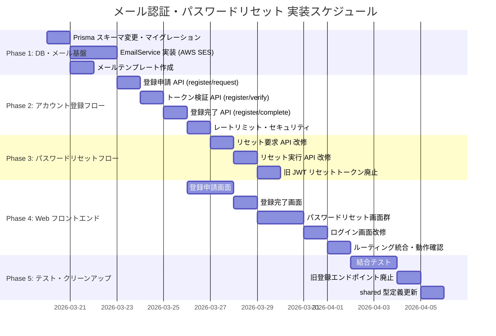

# メール認証・パスワードリセット 実装計画

**作成日:** 2026年3月19日
**対象仕様書:** [メール認証・パスワードリセット仕様書.md](./メール認証・パスワードリセット仕様書.md)
**対象:** バックエンド API + Web フロントエンド

---

## 1. 全体スケジュール



---

## 2. フェーズ詳細

### Phase 1: DB・メール基盤

**目標:** Prisma スキーマ変更と AWS SES によるメール送信基盤が動作する

#### タスク一覧

##### MAIL-1: Prisma スキーマ変更・マイグレーション

| タスクID | タスク名 | 詳細 | 完了条件 |
|----------|----------|------|----------|
| MAIL-1-001 | User モデルに `emailVerified` 追加 | `emailVerified Boolean @default(false)` を追加 | マイグレーション成功 |
| MAIL-1-002 | 既存ユーザーの `emailVerified` 一括更新 | マイグレーション SQL で `UPDATE "User" SET "emailVerified" = true` | 既存ユーザーが全員 `true` |
| MAIL-1-003 | `EmailVerification` モデル作成 | 仕様書 §3.3 の通り。`email`, `inviteCode`, `token`, `expiresAt`, `used` | テーブル作成成功 |
| MAIL-1-004 | `PasswordReset` モデル作成 | 仕様書 §4.3 の通り。`userId` (FK → User), `token`, `expiresAt`, `used` | テーブル作成成功 |
| MAIL-1-005 | User モデルに `passwordResets` リレーション追加 | `passwordResets PasswordReset[]` を User に追加 | Prisma generate 成功 |

**対象ファイル:**
- `apps/api/prisma/schema.prisma`

##### MAIL-1-2: EmailService 実装

| タスクID | タスク名 | 詳細 | 完了条件 |
|----------|----------|------|----------|
| MAIL-1-010 | `@aws-sdk/client-ses` インストール | `pnpm add @aws-sdk/client-ses` (apps/api) | package.json に追加 |
| MAIL-1-011 | EmailService クラス実装 | SES クライアント初期化、`sendEmail()` 汎用メソッド | メール送信成功（開発環境ではコンソール出力） |
| MAIL-1-012 | `sendVerificationEmail()` 実装 | 登録確認メール送信。リンク: `{APP_BASE_URL}/register/complete?token={token}` | メール送信 or コンソール出力確認 |
| MAIL-1-013 | `sendPasswordResetEmail()` 実装 | リセットメール送信。リンク: `{APP_BASE_URL}/reset-password/confirm?token={token}` | メール送信 or コンソール出力確認 |
| MAIL-1-014 | 開発環境フォールバック | `NODE_ENV=development` 時はコンソールにリンク出力、SES 呼び出しをスキップ | 開発環境で AWS 認証不要 |

**対象ファイル:**
- `apps/api/package.json`
- `apps/api/src/services/emailService.ts`（新規）

##### MAIL-1-3: メールテンプレート

| タスクID | タスク名 | 詳細 | 完了条件 |
|----------|----------|------|----------|
| MAIL-1-020 | 共通レイアウト実装 | ヘッダー（光芒祭POSシステム）、フッター（送信専用の旨・著作権表示）を含むHTML関数 | HTMLが正しくレンダリングされる |
| MAIL-1-021 | 登録確認メールテンプレート | 件名・本文・リンクボタン。仕様書 §2.4.1 準拠 | テンプレート関数が正しいHTMLを返す |
| MAIL-1-022 | パスワードリセットメールテンプレート | 件名・本文・リンクボタン。仕様書 §2.4.2 準拠 | テンプレート関数が正しいHTMLを返す |

**対象ファイル:**
- `apps/api/src/templates/layout.ts`（新規）
- `apps/api/src/templates/verification.ts`（新規）
- `apps/api/src/templates/passwordReset.ts`（新規）

**Phase 1 完了条件:**
- [ ] `prisma migrate dev` が成功する
- [ ] 既存ユーザーの `emailVerified` が `true` になっている
- [ ] `EmailVerification`, `PasswordReset` テーブルが作成されている
- [ ] 開発環境でメール送信（コンソール出力）が動作する

---

### Phase 2: アカウント登録フロー（API）

**目標:** メールアドレス検証を含む2ステップ登録APIが動作する

#### タスク一覧

##### MAIL-2-1: 登録申請 API

| タスクID | タスク名 | 詳細 | 完了条件 |
|----------|----------|------|----------|
| MAIL-2-001 | `POST /auth/register/request` ルート追加 | `apps/api/src/routes/auth.ts` にルート定義。バリデーション: email（必須・形式）、inviteCode（必須） | ルート到達確認 |
| MAIL-2-002 | `registerRequest` コントローラー実装 | バリデーション → サービス呼び出し → レスポンス | コントローラー動作確認 |
| MAIL-2-003 | `requestRegistration()` サービス実装 | 招待コード検証 → メール重複チェック → 既存トークン無効化 → トークン生成（`crypto.randomBytes(32)`） → `EmailVerification` 作成 → メール送信 | DB レコード作成 & メール送信 |
| MAIL-2-004 | メール列挙攻撃対策 | メール重複時もエラーを返さず、同一レスポンス（`確認メールを送信しました`）を返す。招待コード無効時のみエラー | レスポンスが統一されている |

##### MAIL-2-2: トークン検証 API

| タスクID | タスク名 | 詳細 | 完了条件 |
|----------|----------|------|----------|
| MAIL-2-010 | `GET /auth/register/verify/:token` ルート追加 | ルート定義 | ルート到達確認 |
| MAIL-2-011 | `verifyRegistration` コントローラー実装 | トークン検索 → 有効性チェック（存在・未使用・期限内） → リダイレクト | 有効トークンで `/register/complete` にリダイレクト |
| MAIL-2-012 | 無効トークン処理 | 無効・期限切れ・使用済みの場合は `/register/expired` にリダイレクト | エラーページにリダイレクト |

##### MAIL-2-3: 登録完了 API

| タスクID | タスク名 | 詳細 | 完了条件 |
|----------|----------|------|----------|
| MAIL-2-020 | `POST /auth/register/complete` ルート追加 | バリデーション: token（必須）、name（必須）、password（必須・8文字以上） | ルート到達確認 |
| MAIL-2-021 | `completeRegistration` コントローラー実装 | バリデーション → サービス呼び出し → レスポンス（201） | コントローラー動作確認 |
| MAIL-2-022 | `completeRegistration()` サービス実装 | トークン検証 → `EmailVerification` から email/inviteCode 取得 → 組織再検証 → メール重複チェック → トランザクション内でユーザー作成（`emailVerified: true`）+ メンバーシップ作成 + ロール割当 + トークン使用済み更新 → JWT発行 | ユーザー作成 & ログイン |
| MAIL-2-023 | 既存 `registerUser()` ロジック流用 | ユーザー作成・メンバーシップ作成・ロール割当のロジックは既存の `registerUser()` から流用。レスポンス形式も同一 | 既存テストが通る形式 |

##### MAIL-2-4: レートリミット

| タスクID | タスク名 | 詳細 | 完了条件 |
|----------|----------|------|----------|
| MAIL-2-030 | 登録申請レートリミット | 同一メールアドレスにつき1分間に1回。`express-rate-limit` のカスタムキー | 連続リクエストが429 |
| MAIL-2-031 | 登録完了レートリミット | 同一トークンにつき1分間に5回 | 連続リクエストが429 |

**対象ファイル:**
- `apps/api/src/routes/auth.ts`
- `apps/api/src/controllers/authController.ts`
- `apps/api/src/services/authService.ts`

**Phase 2 完了条件:**
- [ ] 登録申請 → メール送信 → トークン検証 → 登録完了のフルフローが動作する
- [ ] 不正なトークンで登録完了が拒否される
- [ ] 期限切れトークンで登録完了が拒否される
- [ ] 使用済みトークンで登録完了が拒否される
- [ ] メール重複時にも同一レスポンスが返る
- [ ] レートリミットが動作する

---

### Phase 3: パスワードリセットフロー（API改修）

**目標:** 既存のパスワードリセットAPIをメールベース・DBトークンに移行する

#### タスク一覧

##### MAIL-3-1: リセット要求 API 改修

| タスクID | タスク名 | 詳細 | 完了条件 |
|----------|----------|------|----------|
| MAIL-3-001 | `requestPasswordReset()` サービス改修 | ユーザー検索 → 既存トークン無効化 → `crypto.randomBytes(32)` でトークン生成 → `PasswordReset` レコード作成（有効期限: 15分） → メール送信 | DB レコード作成 & メール送信 |
| MAIL-3-002 | メール列挙攻撃対策 | ユーザー未存在時もエラーを返さず、同一レスポンス（`メールを送信しました`）を返す。現行の `throw new Error('USER_NOT_FOUND')` を除去 | レスポンスが統一されている |
| MAIL-3-003 | コントローラー改修 | レスポンスからトークンを除去。メッセージのみ返す | レスポンスにトークンが含まれない |
| MAIL-3-004 | リセット要求レートリミット | 同一メールアドレスにつき1分間に1回 | 連続リクエストが429 |

##### MAIL-3-2: リセット実行 API 改修

| タスクID | タスク名 | 詳細 | 完了条件 |
|----------|----------|------|----------|
| MAIL-3-010 | `resetPassword()` サービス改修 | JWT 検証を DB トークン検索に変更。`PasswordReset` から token 検索 → 有効性チェック（存在・未使用・期限内） → パスワード更新 → トークン使用済み更新 | パスワードが更新される |
| MAIL-3-011 | トランザクション化 | パスワード更新とトークン使用済み更新をトランザクション内で実行 | アトミックに更新される |
| MAIL-3-012 | 監査ログ追加 | `PASSWORD_RESET` アクションを監査ログに記録 | 監査ログに記録される |
| MAIL-3-013 | リセット実行レートリミット | 同一IPにつき1分間に5回 | 連続リクエストが429 |

##### MAIL-3-3: 旧トークン方式廃止

| タスクID | タスク名 | 詳細 | 完了条件 |
|----------|----------|------|----------|
| MAIL-3-020 | `generateResetToken()` 使用箇所除去 | `authService.ts` から `generateResetToken` の呼び出しを削除 | 未使用 |
| MAIL-3-021 | `verifyResetToken()` 使用箇所除去 | `authService.ts` から `verifyResetToken` の呼び出しを削除 | 未使用 |
| MAIL-3-022 | `jwt.ts` からリセットトークン関数を削除 | `generateResetToken()`, `verifyResetToken()` を削除 | 関数が存在しない |

**対象ファイル:**
- `apps/api/src/services/authService.ts`
- `apps/api/src/controllers/authController.ts`
- `apps/api/src/utils/jwt.ts`

**Phase 3 完了条件:**
- [ ] リセット要求 → メール送信 → 新パスワード設定のフルフローが動作する
- [ ] レスポンスにトークンが含まれない
- [ ] ユーザー未存在時もエラーが返らない
- [ ] 不正・期限切れ・使用済みトークンでリセットが拒否される
- [ ] 監査ログに `PASSWORD_RESET` が記録される
- [ ] `jwt.ts` からリセットトークン関数が削除されている

---

### Phase 4: Web フロントエンド

**目標:** 2ステップ登録とパスワードリセットの画面が動作する

#### タスク一覧

##### MAIL-4-1: 登録画面群

| タスクID | タスク名 | 詳細 | 完了条件 |
|----------|----------|------|----------|
| MAIL-4-001 | 登録申請画面 (`/register`) | メールアドレス + 招待コード入力フォーム。React Hook Form + Zod バリデーション | フォーム送信で API 呼び出し |
| MAIL-4-002 | メール送信完了画面 (`/register/sent`) | 「確認メールを送信しました」メッセージ表示。メール再送リンク | 画面表示確認 |
| MAIL-4-003 | 登録完了画面 (`/register/complete`) | クエリパラメータ `token`, `email` を受け取り、名前 + パスワード入力フォーム表示。メールアドレスは表示のみ（編集不可） | フォーム送信でアカウント作成 & 自動ログイン |
| MAIL-4-004 | リンク期限切れ画面 (`/register/expired`) | 「有効期限が切れました」メッセージ + 再申請リンク | 画面表示確認 |

##### MAIL-4-2: パスワードリセット画面群

| タスクID | タスク名 | 詳細 | 完了条件 |
|----------|----------|------|----------|
| MAIL-4-010 | リセット申請画面 (`/reset-password`) | メールアドレス入力フォーム | フォーム送信で API 呼び出し |
| MAIL-4-011 | リセットメール送信完了画面 (`/reset-password/sent`) | 「メールを送信しました」メッセージ | 画面表示確認 |
| MAIL-4-012 | パスワード再設定画面 (`/reset-password/confirm`) | クエリパラメータ `token` を受け取り、新パスワード + 確認入力フォーム | フォーム送信でパスワード更新 → ログイン画面へ遷移 |

##### MAIL-4-3: 既存画面改修・ルーティング

| タスクID | タスク名 | 詳細 | 完了条件 |
|----------|----------|------|----------|
| MAIL-4-020 | ログイン画面改修 | 「パスワードを忘れた方」リンクを `/reset-password` に変更。「アカウント作成」リンクを `/register` に変更 | リンク遷移確認 |
| MAIL-4-021 | ルーティング追加 | React Router に新規ルートを追加（認証不要ルート） | 全画面にアクセス可能 |
| MAIL-4-022 | API クライアント関数追加 | 新規エンドポイント用の fetch 関数を追加 | API 呼び出し成功 |

**対象ファイル:**
- `apps/web/src/pages/register/`（新規ディレクトリ）
- `apps/web/src/pages/reset-password/`（新規ディレクトリ）
- `apps/web/src/` — ルーティング・ログイン画面の既存ファイル

**Phase 4 完了条件:**
- [ ] 登録申請 → メール確認 → 登録完了画面で名前・パスワード設定 → 自動ログイン が動作する
- [ ] パスワードリセット申請 → メール確認 → 新パスワード設定 → ログイン画面へ遷移 が動作する
- [ ] ログイン画面から各フローへの遷移が動作する
- [ ] バリデーションエラーが適切に表示される
- [ ] 期限切れトークンでアクセスした場合にエラー画面が表示される

---

### Phase 5: テスト・クリーンアップ

**目標:** 全フローの結合テスト完了と不要コードの除去

#### タスク一覧

##### MAIL-5-1: 結合テスト

| タスクID | タスク名 | 詳細 | 完了条件 |
|----------|----------|------|----------|
| MAIL-5-001 | 登録フロー結合テスト | 申請 → メール送信（dev モード） → トークン検証 → 完了 → ログイン確認 | フルフロー成功 |
| MAIL-5-002 | リセットフロー結合テスト | 要求 → メール送信（dev モード） → 新パスワード設定 → 新パスワードでログイン | フルフロー成功 |
| MAIL-5-003 | エラーケーステスト | 期限切れトークン、使用済みトークン、不正トークン、メール重複、無効招待コード | 全ケースで適切なエラー |
| MAIL-5-004 | レートリミットテスト | 各エンドポイントの制限値を超えるリクエスト | 429 レスポンス確認 |
| MAIL-5-005 | 既存ログインフロー回帰テスト | 既存のログイン機能が影響を受けていないことを確認 | 既存テスト全パス |

##### MAIL-5-2: クリーンアップ

| タスクID | タスク名 | 詳細 | 完了条件 |
|----------|----------|------|----------|
| MAIL-5-010 | 旧 `POST /auth/register` 廃止 | ルート・コントローラー・サービスの旧登録ロジック削除 | エンドポイント404 |
| MAIL-5-011 | shared 型定義更新 | `packages/shared/src/types/auth.ts` に新しいリクエスト/レスポンス型を追加。旧型の削除 | 型がビルドを通る |
| MAIL-5-012 | 環境変数ドキュメント更新 | `.env.example` に AWS SES 関連の変数を追加 | 変数が記載されている |

**Phase 5 完了条件:**
- [ ] 全結合テストが成功する
- [ ] 旧登録エンドポイントが削除されている
- [ ] shared パッケージの型定義が最新
- [ ] 環境変数のドキュメントが更新されている

---

## 3. 優先順位の考え方

```
Phase 1: DB・メール基盤（全機能の土台）
    ↓
Phase 2: 登録フロー API（メイン機能）
    ↓
Phase 3: リセットフロー API（既存改修・リスク低）
    ↓
Phase 4: Web フロントエンド（API 完成後に実装）
    ↓
Phase 5: テスト・クリーンアップ（最終確認）
```

> Phase 2 と Phase 3 は API 層のみのため、フロントエンド（Phase 4）と並行して開発しても問題ない。ただし Phase 4 の登録画面群は Phase 2 の API 完成を、リセット画面群は Phase 3 の API 完成を前提とする。

---

## 4. 前提・依存関係

| 前提条件 | 状態 |
|---------|------|
| AWS SES が本番環境（サンドボックス解除済み） | 済 |
| `ukeja.com` ドメインが SES で検証済み | 済 |
| IAM ユーザー（SES 送信権限）が作成済み | 要確認 |
| `APP_BASE_URL` が決まっている | 要確認 |
| 既存のログイン・ユーザー管理 API が稼働中 | 済 |

---

## 5. リスクと対策

| リスク | 対策 |
|--------|------|
| SES 送信レート制限に達する | 開発中はコンソール出力で代替。本番は学園祭規模（数百件/日）のため問題なし |
| メールが迷惑メールフォルダに入る | SPF/DKIM/DMARC 設定を確認。テスト送信で受信確認 |
| トークンの期限切れによるユーザー離脱 | 登録は24時間、リセットは15分と十分な期限を設定。期限切れ画面に再送リンクを配置 |
| 既存ユーザーへの影響 | `emailVerified = true` で一括更新するため影響なし |
| 旧登録エンドポイント廃止時の iOS アプリへの影響 | iOS アプリは現時点で登録機能を使用していない（ログインのみ）。Web のみ対象 |

---

## 6. マイルストーン

| マイルストーン | 完了条件 |
|--------------|----------|
| DB・メール基盤完了 | スキーマ変更完了、開発環境でメール送信（コンソール）動作 |
| **登録フロー API 完了** | 2ステップ登録のフルフローが API レベルで動作 |
| **リセットフロー API 完了** | メールベースのリセットフローが API レベルで動作 |
| **Web フロントエンド完了** | 全画面が動作し、API と結合済み |
| **全体完了** | 結合テスト成功、旧コード除去、ドキュメント更新 |
