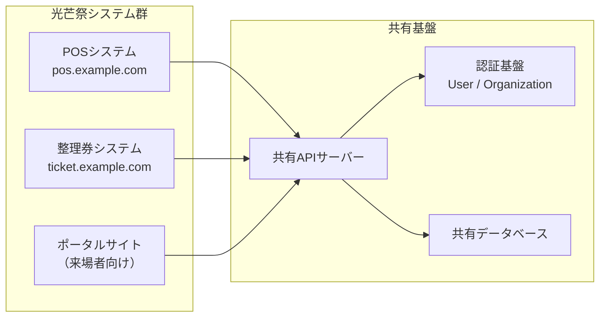
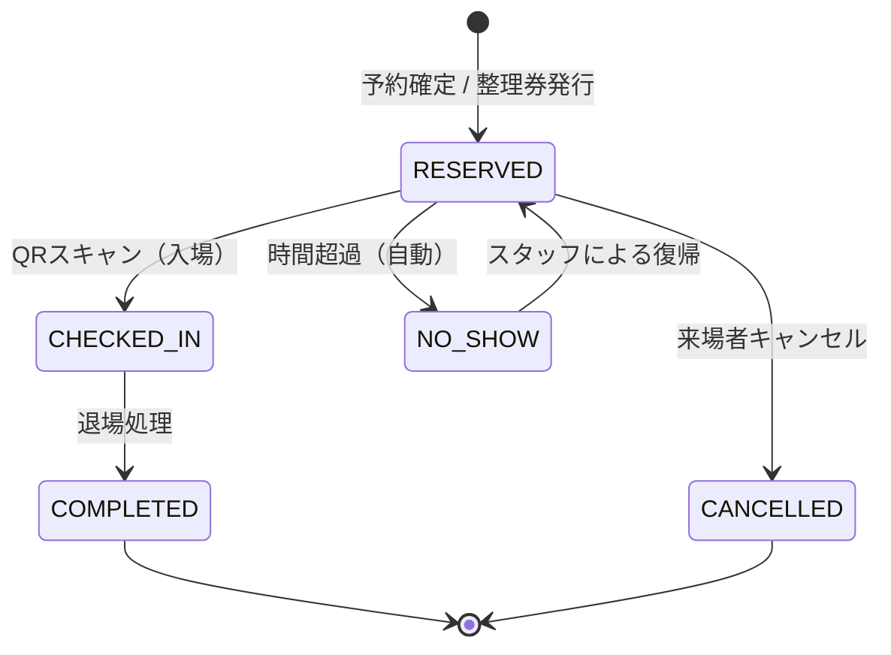
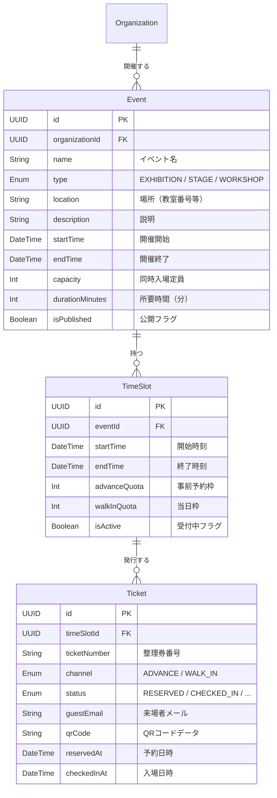

# 整理券システム 要件定義書

**作成日:** 2026年3月8日  
**作成者:** 岩田 宗也  
**版数:** 0.2（ドラフト）

---

## 1. 背景と目的

### 1.1 背景

光芒祭では教室展示・ステージイベント・ワークショップなど多数の催しが開催される。人気のある展示やイベントには来場者が集中し、長時間の行列や入場待ちが発生する。これにより来場者の体験が損なわれるだけでなく、廊下の混雑による安全上の問題も生じる。

### 1.2 目的

- **来場者体験の向上**: 事前予約・整理券による待ち時間の削減。行列に並ぶ必要がなくなる
- **安全性の確保**: 教室定員の管理、廊下の混雑緩和
- **運営効率の向上**: 入場管理の自動化、来場者数の可視化
- **データ活用**: 各展示・イベントの人気度・来場者動向の把握

### 1.3 スコープ

| 対象 | 具体例 |
|------|--------|
| 教室展示 | お化け屋敷、謎解き、展示発表、縁日 等 |
| ステージイベント | バンド演奏、ダンス公演、演劇 等 |
| ワークショップ | 体験型教室（工作、実験、料理教室 等） |

### 1.4 システム位置づけ



- **POSシステム**: 出店団体の売上・決済管理（既存）
- **整理券システム**: 展示・イベントの入場予約・整理券管理（**本ドキュメントの対象**）
- **ポータルサイト**: 来場者が事前予約を行うフロントエンド
- **認証基盤**: POSと整理券システムで共通のアカウント（User / Organization）を使用

---

## 2. 用語定義

| 用語 | 定義 |
|------|------|
| イベント | 整理券の対象となる催し（教室展示、ステージ、ワークショップの総称） |
| タイムスロット | イベントの入場可能な時間枠（例: 10:00〜10:30） |
| 事前予約枠 | ポータルサイトから事前に予約できる枠数 |
| 当日枠 | 当日現地で整理券を取得できる枠数 |
| 整理券 | 来場者が取得する入場権。QRコード付きで発行される |
| 受付端末 | 展示室入口に設置し、当日の整理券発行・入場受付を行うデバイス |

---

## 3. ユーザー種別

| ユーザー種別 | 対象者 | アクセス方法 | 認証 |
|-------------|--------|-------------|------|
| **来場者（ゲスト）** | 一般来場者 | ポータルサイト / 現地QRコード | 認証不要（メールアドレスのみ or 匿名） |
| **スタッフ** | 展示団体のスタッフ | 整理券管理画面 | POSと同一アカウント（STAFF） |
| **団体管理者** | 展示団体のリーダー | 整理券管理画面 | POSと同一アカウント（ORG_ADMIN） |
| **実行委員** | 実行委員会 | システム管理画面 | POSと同一アカウント（SYSTEM_ADMIN） |

---

## 4. 機能要件

### 4.1 イベント管理（団体管理者 / 実行委員）

- **FR-001**: イベント（展示・ステージ・ワークショップ）を登録・編集・削除できる
- **FR-002**: イベントの種別を設定できる（`EXHIBITION` / `STAGE` / `WORKSHOP`）
- **FR-003**: イベントごとに以下の基本情報を設定できる
  - イベント名、説明文、場所（教室番号 / ステージ名）
  - 開催時間帯（開始〜終了）
  - 同時入場定員
  - 1回あたりの所要時間（ワークショップ等で使用）
- **FR-004**: イベントの公開 / 非公開を切り替えられる

### 4.2 タイムスロット管理（団体管理者）

- **FR-005**: イベントに対してタイムスロット（時間枠）を設定できる
  - 自動生成: 開催時間帯と所要時間から等間隔で自動作成
  - 手動作成: 個別にスロットを追加
- **FR-006**: スロットごとに**事前予約枠数**と**当日枠数**を個別に設定できる
- **FR-007**: スロットの枠数をリアルタイムで増減できる（当日の状況に応じた柔軟対応）
- **FR-008**: スロットの受付開始日時・締切日時を設定できる
- **FR-009**: 特定スロットの一時停止・再開ができる

### 4.3 事前予約（来場者 → ポータルサイト）

- **FR-010**: 来場者はポータルサイトからイベント一覧を閲覧できる
- **FR-011**: 空き枠のあるタイムスロットを選択して予約できる
- **FR-012**: 予約時にメールアドレスの入力を求め、確認メール（QRコード付き）を送信する
- **FR-013**: 来場者は予約確認ページで自分の予約一覧を確認できる
- **FR-014**: 予約のキャンセルができる（キャンセル期限の設定可能）
- **FR-015**: 1人あたりの同時予約上限を設定できる（例: 最大3件まで）

### 4.4 当日整理券（来場者 → 現地）

- **FR-016**: 展示室入口の受付端末で、当日枠の整理券を発行できる
- **FR-017**: 整理券はQRコード付きで画面に表示され、来場者がスマホで読み取る
- **FR-018**: 空き枠がない場合は「満員」と表示し、次の空き時間帯を案内する
- **FR-019**: 受付端末は来場者の操作に特化したシンプルなUIとする（キオスク端末的）

### 4.5 入場受付・チェックイン（スタッフ）

- **FR-020**: 来場者が提示するQRコードをスキャンして入場チェックインを行う
- **FR-021**: チェックイン時にQRコードの有効性を検証する（正しいイベント・時間帯・未使用）
- **FR-022**: チェックイン済みの整理券で再入場しようとした場合はエラーを表示する
- **FR-023**: 現在の入場者数をリアルタイムで表示する（定員管理）
- **FR-024**: 退場処理（手動 or 自動）で入場者カウントを減算する

### 4.6 ステータスモニター（スタッフ / 団体管理者）

- **FR-025**: 各スロットの予約状況（予約済み / 空き / 入場中 / 完了）を一覧表示する
- **FR-026**: 当日のタイムラインビューで、時間帯ごとの混雑状況を可視化する
- **FR-027**: 呼び出し機能: 次の入場グループに対して呼び出し通知を送る（画面表示 / サウンド）

### 4.7 統計・分析（団体管理者 / 実行委員）

- **FR-028**: イベントごとの来場者数、予約率、キャンセル率を集計する
- **FR-029**: 時間帯別の来場者推移グラフを表示する
- **FR-030**: 全イベント横断の人気ランキングを表示する（実行委員向け）

---

## 5. 整理券ステータス定義

| ステータス | 説明 |
|-----------|------|
| `RESERVED` | 予約済み（事前予約 or 当日発券済み。未チェックイン） |
| `CHECKED_IN` | チェックイン済み（入場中） |
| `COMPLETED` | 完了（退場済み） |
| `CANCELLED` | キャンセル済み（来場者による取り消し） |
| `NO_SHOW` | 不来場（時間を過ぎても来場しなかった） |
| `EXPIRED` | 期限切れ（スロット終了後に自動遷移） |

### 5.1 ステータス遷移図



---

## 6. 枠管理の仕組み

### 6.1 事前予約枠と当日枠の関係

```
┌───────────── タイムスロット 10:00〜10:30 ─────────────┐
│                                                       │
│  同時入場定員: 30名                                    │
│                                                       │
│  ┌─ 事前予約枠: 20名 ─┐  ┌─ 当日枠: 10名 ─┐         │
│  │ ポータルから予約     │  │ 現地端末で取得   │         │
│  │ 予約済: 18 / 空: 2  │  │ 発券済: 5 / 空: 5│         │
│  └─────────────────────┘  └─────────────────┘         │
│                                                       │
│  ※ 事前予約の空き枠を当日枠に振替可能（設定による）     │
└───────────────────────────────────────────────────────┘
```

- 事前予約枠と当日枠は**スロットごとに独立して設定**
- 団体管理者は当日の状況に応じて枠数を動的に調整可能
- オプション: 事前予約の締切後、未消化枠を当日枠へ自動振替

### 6.2 イベント種別ごとの運用パターン

| 種別 | スロット | 定員 | 典型的な運用 |
|------|---------|------|-------------|
| **教室展示** | 任意（常時入場 or 時間枠制） | 教室定員 | 常時入場で定員管理、または回転制 |
| **ステージ** | 公演ごと | 座席数 | 公演単位でスロット作成 |
| **ワークショップ** | 開催回ごと | 参加定員 | 所要時間ベースでスロット生成 |

---

## 7. 既存システムとの連携

### 7.1 共有するもの

| 項目 | 詳細 |
|------|------|
| **User テーブル** | 同一のユーザーアカウント |
| **Organization テーブル** | 同一の団体管理 |
| **UserOrganization テーブル** | 権限（ADMIN / STAFF）の共有 |
| **認証基盤** | 同一のJWT認証 |
| **APIサーバー** | 同一のExpressサーバーに整理券用ルートを追加 |

### 7.2 独立するもの

| 項目 | 詳細 |
|------|------|
| **フロントエンド** | POS（`pos.example.com`）とは別URL（`ticket.example.com`）で配信 |
| **来場者向けポータル** | 別途構築（`portal.example.com` 等） |
| **データモデル** | イベント・スロット・整理券は新規テーブルとして追加 |

---

## 8. データモデル概要



---

## 9. 画面要件（概要）

### 9.1 来場者向け（ポータルサイト）

| 画面 | 概要 |
|------|------|
| イベント一覧 | 全公開イベントの一覧・検索・フィルタ |
| イベント詳細 | スロット一覧と空き状況、予約ボタン |
| 予約確認 | 予約完了画面、QRコード表示 |
| マイ予約 | 自分の予約一覧、キャンセル機能 |

### 9.2 当日受付端末（キオスク）

| 画面 | 概要 |
|------|------|
| 整理券発行 | 当日枠の時間帯選択・整理券発行・QR表示 |
| 待ち状況表示 | 各時間帯の空き状況をリアルタイム表示 |

### 9.3 スタッフ向け（整理券管理画面）

| 画面 | 概要 |
|------|------|
| ダッシュボード | 本日のスケジュール、入場状況サマリー |
| チェックイン | QRスキャン、入場受付 |
| スロット管理 | 枠数調整、一時停止 |
| 整理券一覧 | 全整理券のステータス管理 |
| 呼び出しモニター | 次の入場グループの呼び出し |

### 9.4 団体管理者向け

| 画面 | 概要 |
|------|------|
| イベント設定 | イベント作成・編集 |
| スロット設定 | タイムスロットの生成・枠数設定 |
| 統計 | 来場者数・予約率の分析 |

---

## 10. 非機能要件

### 10.1 リアルタイム性
- 空き枠の更新は **2秒以内** に全画面へ反映（Socket.io）
- チェックイン結果は即座にスタッフ画面に反映

### 10.2 同時アクセス耐性
- 人気イベントへの同時予約リクエストに対する**排他制御**（ダブルブッキング防止）
- 最大100名/秒の同時アクセスを想定

### 10.3 可用性
- 受付端末は長時間稼働に耐えること（メモリリーク対策）
- ネットワーク切断時は「接続中...」と表示し、自動再接続

### 10.4 セキュリティ
- QRコードは推測不可能な一意のトークンを含む
- 整理券の不正コピー対策（1回限り有効）

---

## 11. 検討事項・未決定事項

> [!IMPORTANT]
> 以下の項目は要件確定前に検討が必要です。

1. **入場定員の管理方式**: 同時入場定員（常に30名以下を維持）vs スロット定員（1回あたり30名入場）のどちらか？ → **要検討中**

2. **来場者の認証**: メールアドレスのみ？ LINE連携？ 完全匿名（当日枠のみ）？

3. **通知手段**: 予約確認メール以外に、リマインダー通知やプッシュ通知は必要か？

4. **キャンセルポリシー**: キャンセル期限の設定（例: 開始30分前まで）が必要か？

5. **No-show対応**: 時間を過ぎた場合の自動キャンセル猶予時間（例: 開始後10分まで待機）

6. **複数人予約**: 1枚の整理券で複数名（友人グループ）の入場を許可するか？

7. **ポータルサイトの構成**: 整理券システムのフロントエンドに統合するか、別アプリとするか？

---

## 12. 今後のステップ

1. **検討事項の決定** → セクション11の各項目を決定
2. **画面設計** → 各画面のワイヤーフレーム作成
3. **DB設計** → テーブル定義、既存スキーマへの追加
4. **API設計** → エンドポイント定義
5. **技術設計** → QRコード生成、メール送信、リアルタイム通信の技術選定
6. **開発フェーズ計画** → 実装スケジュール策定
