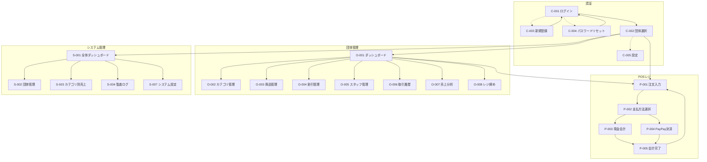
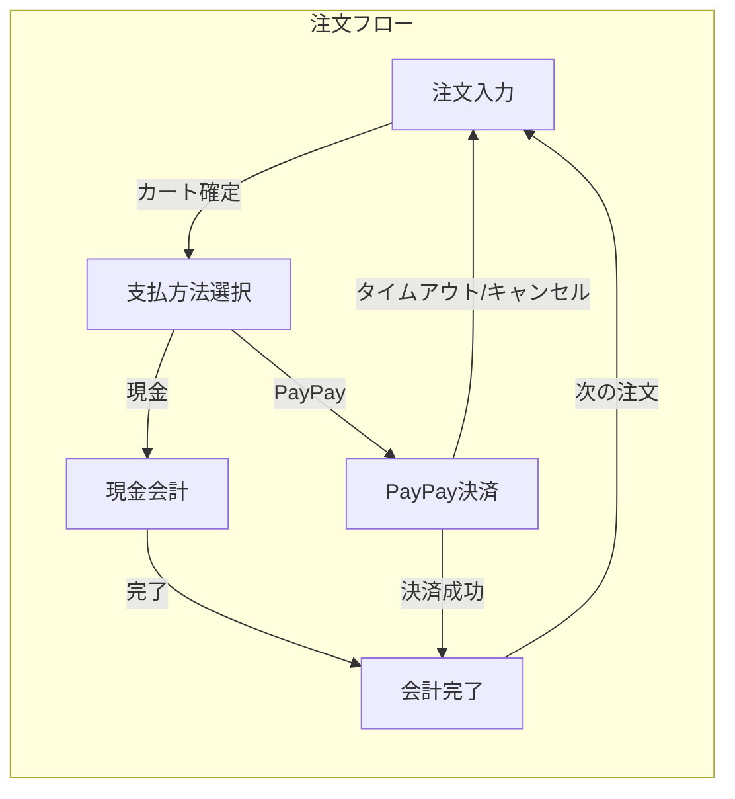

# 光芒祭POSシステム - 画面設計書

**作成日:** 2026年2月3日  
**版数:** 1.0

---

## 1. 画面一覧

### 1.1 共通画面

| 画面ID | 画面名 | 対象ロール | 概要 |
|--------|--------|------------|---------|
| C-001 | ログイン | 全員 | メール/パスワードでのログイン |
| C-002 | 団体選択 | 複数団体所属ユーザー | 操作対象の団体を選択 |
| C-003 | 新規登録 | 未登録ユーザー | アカウント作成、招待コード入力 |
| C-004 | パスワードリセット | 全員 | パスワード再設定フロー |
| C-005 | 設定 | 全員 | 通知設定、アカウント設定、ログアウト |
| C-006 | プロフィール編集 | 全員 | 名前・パスワード変更 |

### 1.2 POSレジ画面 (STAFF / ORG_ADMIN)

| 画面ID | 画面名 | 概要 |
|--------|--------|------|
| P-001 | 注文入力 | 商品ボタン、カート、合計表示 |
| P-002 | 支払方法選択 | 現金/PayPayの選択 |
| P-003 | 現金会計 | 預かり金入力、お釣り計算 |
| P-004 | PayPay決済 | QRコード表示、カウントダウン、完了待機 |
| P-005 | 会計完了 | 完了メッセージ、次の注文へ |
| P-006 | 割引選択モーダル | 割引プリセット一覧から選択 |
| P-007 | 数量変更モーダル | カート内商品の数量変更・削除 |

### 1.3 団体管理画面 (ORG_ADMIN)

| 画面ID | 画面名 | 概要 |
|--------|--------|------|
| O-001 | ダッシュボード | 売上サマリー、クイック操作 |
| O-002 | カテゴリ管理 | カテゴリのCRUD |
| O-003 | 商品管理 | 商品のCRUD、カテゴリ割当 |
| O-004 | 割引管理 | 割引プリセットのCRUD |
| O-005 | スタッフ管理 | 招待、権限変更 |
| O-006 | 取引履歴 | 過去取引一覧、返金処理 |
| O-007 | 売上分析 | グラフ、ランキング表示 |
| O-008 | レジ締め | 準備金入力、実現金入力、過不足確認 |
| O-009 | 取引詳細 | 取引の詳細表示、返金実行 |
| O-010 | 商品編集モーダル | 商品の追加・編集フォーム |
| O-011 | カテゴリ編集モーダル | カテゴリの追加・編集 |
| O-012 | 割引編集モーダル | 割引の追加・編集（対象・条件・トリガー・有効期間設定を含む） |
| O-013 | スタッフ招待・編集 | 招待コード表示、権限変更 |

### 1.4 システム管理画面 (SYSTEM_ADMIN)

| 画面ID | 画面名 | 概要 |
|--------|--------|------|
| S-001 | 全体ダッシュボード | 全団体の売上、稼働状況 |
| S-002 | 団体管理 | 団体作成、招待コード発行 |
| S-003 | カテゴリ別売上 | カテゴリ別の売れ行き分析 |
| S-004 | 監査ログ | 全操作ログの閲覧 |
| S-005 | 団体詳細・編集 | 団体情報編集、招待コード再発行、メンバー権限管理 |
| S-006 | ログ詳細 | 監査ログの詳細表示 |
| S-007 | システム設定 | PayPay API設定、開催日時設定、緊急停止 |

### 1.5 エラー・状態画面

| 画面ID | 画面名 | 概要 |
|--------|--------|--------|
| E-001 | 401 Unauthorized | 認証エラー（ログイン必要） |
| E-002 | 403 Forbidden | アクセス権限なし |
| E-003 | 404 Not Found | ページが見つからない |
| E-004 | 500 Server Error | サーバーエラー |
| E-005 | オフライン表示 | ネットワーク切断時（Phase 2） |

---

## 2. 画面遷移図

### 2.1 全体遷移図



### 2.2 POSレジ詳細遷移



---

## 3. ワイヤーフレーム（スマホ縦向き基準）

> **対象デバイス**: スマートフォン（縦向き 375px~）をメインとして設計

### 3.1 P-001 注文入力画面

```
┌─────────────────────────┐
│  光芒祭POS  〇〇団体  ⚙ │
├─────────────────────────┤
│ [フード][ドリンク][グッズ]│  ← カテゴリタブ
├─────────────────────────┤
│ ┌─────┐┌─────┐┌─────┐ │
│ │たこ焼き││焼きそば││フランク│ │
│ │ ¥300 ││ ¥400 ││ ¥250 │ │
│ └─────┘└─────┘└─────┘ │
│ ┌─────┐┌─────┐┌─────┐ │
│ │ 綿菓子 ││ かき氷 ││ジュース│ │
│ │ ¥200 ││ ¥300 ││ ¥150 │ │
│ └─────┘└─────┘└─────┘ │
│          ︙             │  ← スクロール可
├─────────────────────────┤
│ ▼ カート (2点)          │  ← タップで展開
│   たこ焼き x2    ¥600   │
│   焼きそば x1    ¥400   │
├─────────────────────────┤
│  小計          ¥1,000   │
│  [割引を適用]            │
├─────────────────────────┤
│ ┌─────────────────────┐ │
│ │   ▶ 会計へ (¥1,000)  │ │
│ └─────────────────────┘ │
└─────────────────────────┘
```

**操作説明:**
- 商品ボタンをタップ → カートに追加（数量+1）
- カート部分をタップ → 展開して詳細表示
- カート内商品をタップ → 数量変更/削除モーダル
- 売り切れ商品はグレーアウト＋「SOLD」バッジ
- 「会計へ」→ P-002へ遷移（※割引計算は次の画面で実施）

---

### 3.2 P-002 支払方法選択画面

```
┌─────────────────────────┐
│ ←  注文内容の確認        │
├─────────────────────────┤
│                         │
│  焼きそば x 2    ¥1,000 │
│  ドリンク x 1      ¥150 │
│ ─────────────────────── │
│  小計            ¥1,150 │
│  自動適用割引     -¥100 │
│                         │
│  [ 🏷️ 割引/クーポン適用 ] │
│                         │
│  合計金額        ¥1,050 │
│                         │
│ ┌─────────────────────┐ │
│ │   💴 現金で支払う    │ │
│ └─────────────────────┘ │
│ ┌─────────────────────┐ │
│ │  📱 PayPayで支払う   │ │
│ └─────────────────────┘ │
│                         │
└─────────────────────────┘
```

**操作説明:**
- 注文内容（商品・数量・単価）の最終確認
- 自動適用された割引（セット割など）の表示
- 「割引/クーポン適用」→ 手動割引選択モーダルを表示
- 「現金で支払う」→ P-003へ遷移
- 「PayPayで支払う」→ PayPay QRコード生成・待機画面へ遷移

---

### 3.3 P-003 現金会計画面

```
┌─────────────────────────┐
│ ←  現金会計              │
├─────────────────────────┤
│                         │
│        合計金額          │
│       ¥1,000            │
│                         │
│    ┌ 預かり金額 ───────┐ │
│    │   ¥ [ 1500 ]      │ │
│    └───────────────────┘ │
│                         │
│   ┌───┐┌───┐┌────┐    │
│   │+100││+500││+1000│    │
│   └───┘└───┘└────┘    │
│   ┌────┐┌─────┐┌───┐ │
│   │+5000││+10000││ C  │ │
│   └────┘└─────┘└───┘ │
│                         │
│        お釣り            │
│       ¥500              │
│                         │
│ ┌─────────────────────┐ │
│ │   ✓ 会計を完了する    │ │
│ └─────────────────────┘ │
└─────────────────────────┘
```

**操作説明:**
- 金額ボタンで素早く加算入力
- C ボタンでクリア
- お釣りが負（不足）の場合は完了ボタン無効化

---

### 3.4 P-004 PayPay決済画面

```
┌─────────────────────────┐
│ ✕  PayPay決済            │
├─────────────────────────┤
│                         │
│        合計金額          │
│       ¥1,000            │
│                         │
│    ┌───────────────┐    │
│    │               │    │
│    │  ▓▓▓▓▓▓▓▓▓   │    │
│    │  ▓ QRコード ▓  │    │
│    │  ▓        ▓   │    │
│    │  ▓▓▓▓▓▓▓▓▓   │    │
│    │               │    │
│    └───────────────┘    │
│                         │
│  お客様にスキャンして    │
│  もらってください        │
│                         │
│       ⏱ 残り 4:32       │
│   ████████████░░░░░     │
│                         │
│ ┌─────────────────────┐ │
│ │    ✕ キャンセル      │ │
│ └─────────────────────┘ │
└─────────────────────────┘
```

**操作説明:**
- 5分のカウントダウンタイマー表示
- QRコードはデバイスの画面輝度を自動最大化（推奨）
- 決済完了 → 自動的にP-005へ遷移
- タイムアウト → P-001に戻り、トースト通知
- キャンセルボタン → 確認ダイアログ後、P-001へ

---

### 3.5 P-005 会計完了画面

```
┌─────────────────────────┐
│        会計完了          │
├─────────────────────────┤
│                         │
│          ✓              │
│       会計完了           │
│                         │
│   ───────────────────     │
│   たこ焼き x2    ¥600   │
│   焼きそば x1    ¥400   │
│   ───────────────────     │
│     合計      ¥1,000    │
│    支払方法   PayPay    │
│   ───────────────────     │
│                         │
│ ┌─────────────────────┐ │
│ │     次の注文へ       │ │
│ └─────────────────────┘ │
│                         │
│    (3秒後に自動遷移)     │
│                         │
└─────────────────────────┘
```

---

### 3.6 O-001 団体ダッシュボード

```
┌─────────────────────────────────────────────────────────────┐
│  [≡]  光芒祭POS  │  〇〇団体  │  田中太郎(管理者)  │ [⚙]  │
├─────────────────────────────────────────────────────────────┤
│                                                             │
│  ┌─ 本日の売上 ─┐  ┌─ 取引件数 ──┐  ┌─ 客単価 ────┐      │
│  │   ¥48,500   │  │    62件     │  │    ¥782    │      │
│  └──────────────┘  └─────────────┘  └─────────────┘      │
│                                                             │
│  ┌─ クイックアクセス ─────────────────────────────────────┐ │
│  │  [📱 レジを開く]  [📦 商品管理]  [👥 スタッフ管理]     │ │
│  └─────────────────────────────────────────────────────────┘ │
│                                                             │
│  ┌─ 売上推移（時間別）─────────────────────────────────────┐ │
│  │  📊 [グラフエリア]                                      │ │
│  └─────────────────────────────────────────────────────────┘ │
│                                                             │
│  ┌─ 商品別ランキング ─────────────────────────────────────┐ │
│  │  1. たこ焼き       ¥12,000 (40個)                       │ │
│  │  2. 焼きそば       ¥10,000 (25個)                       │ │
│  │  3. かき氷         ¥8,400 (28個)                        │ │
│  └─────────────────────────────────────────────────────────┘ │
│                                                             │
├─────────────────────────────────────────────────────────────┤
│  [📊 ダッシュ] [📦 商品] [🏷 割引] [👥 スタッフ] [📜 履歴]   │
└─────────────────────────────────────────────────────────────┘
```

---

### 3.7 S-001 システム管理ダッシュボード

```
┌─────────────────────────────────────────────────────────────┐
│  [≡]  光芒祭POS 管理コンソール  │  実行委員会  │ [⚙]      │
├─────────────────────────────────────────────────────────────┤
│                                                             │
│  ┌─ 全体売上 ───┐  ┌─ 稼働団体 ──┐  ┌─ 取引件数 ──┐      │
│  │  ¥523,000   │  │   18/20    │  │   847件    │      │
│  └──────────────┘  └─────────────┘  └─────────────┘      │
│                                                             │
│  ┌─ カテゴリ別売上 ───────────────────────────────────────┐ │
│  │  フード   ████████████████████  ¥312,000 (59.7%)       │ │
│  │  ドリンク ████████████          ¥156,000 (29.8%)       │ │
│  │  グッズ   ████                  ¥55,000 (10.5%)        │ │
│  └─────────────────────────────────────────────────────────┘ │
│                                                             │
│  ┌─ 団体別売上ランキング ─────────────────────────────────┐ │
│  │  1. 電子情報工学科2年  ¥68,000  [詳細]                  │ │
│  │  2. 機械科学科1年      ¥52,000  [詳細]                  │ │
│  │  3. ...                                                 │ │
│  └─────────────────────────────────────────────────────────┘ │
│                                                             │
│  ┌─ アラート ─────────────────────────────────────────────┐ │
│  │  ⚠ 建築学科 - 30分以上取引なし                          │ │
│  └─────────────────────────────────────────────────────────┘ │
│                                                             │
├─────────────────────────────────────────────────────────────┤
│  [📊 ダッシュ] [🏢 団体管理] [📈 カテゴリ分析] [📜 監査ログ] │
└─────────────────────────────────────────────────────────────┘
```

---

## 4. 画面間共通ルール

### 4.1 ナビゲーション
- **ヘッダー**: ロゴ、現在の団体名、ユーザー名、設定ボタン
- **フッター/サイドバー**: ロール別のメニュー項目
- **戻るボタン**: 階層ナビゲーション対応

### 4.2 レスポンシブ対応
- **スマホ (375px~)**: POSレジ画面メイン対応（縦向き基準）
- **タブレット (768px~)**: 団体管理画面に最適化
- **PC (1024px~)**: システム管理画面フル機能

### 4.3 カラースキーム
- **プライマリ**: 学祭テーマカラー（要決定）
- **成功**: 緑系（#22c55e）
- **警告**: 黄系（#f59e0b）
- **エラー**: 赤系（#ef4444）
- **ダークモード対応**

---

## 5. 検討事項

### 5.1 今後決めるべきこと
1. 学祭のテーマカラー（ブランディング）
2. ログイン画面のデザイン（ロゴ等）

### 5.2 オプション機能（Phase 2以降）
- オフライン対応時のUI変更（オフラインバナー等）
- プッシュ通知（売り切れアラートなど）
