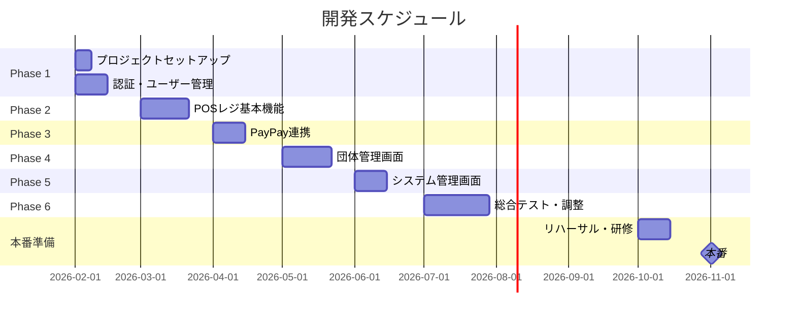

# 光芒祭POSシステム - 開発フェーズ計画

**作成日:** 2026年2月3日  
**目標:** 2026年11月初旬の学祭本番

---

> **📁 詳細ドキュメント**
> 
> 各フェーズの詳細タスクは以下を参照してください：
> - [Phase 1: 基盤構築](./開発フェーズ/phase1.md)
> - [Phase 2: POSレジ基本機能](./開発フェーズ/phase2.md)
> - [Phase 3: PayPay連携](./開発フェーズ/phase3.md)
> - [Phase 4: 団体管理画面](./開発フェーズ/phase4.md)
> - [Phase 5: システム管理画面](./開発フェーズ/phase5.md)
> - [Phase 6: 総合テスト・調整](./開発フェーズ/phase6.md)
> - [カバレッジ確認](./開発フェーズ/coverage.md)

---

## 1. 全体スケジュール



---

## 2. フェーズ詳細

### Phase 1: 基盤構築（2月）

**目標:** 開発環境とコア機能の土台を作る

| タスク | 内容 |
|--------|------|
| プロジェクトセットアップ | Monorepo作成、Vite/Express初期化、Prisma設定 |
| DB構築 | PostgreSQL/SQLite設定、マイグレーション実行 |
| 認証システム | ログイン/登録API、JWT認証、ミドルウェア |
| 基本UI | レイアウト、ナビゲーション、共通コンポーネント |

**完了条件:**
- [ ] `pnpm dev` で開発サーバー起動
- [ ] ログイン/ログアウトが動作
- [ ] 団体選択画面が表示

---

### Phase 2: POSレジ基本機能（3月）

**目標:** 現金決済でPOSレジが動作する

| タスク | 内容 |
|--------|------|
| 商品一覧表示 | カテゴリタブ、商品グリッド |
| カート機能 | 追加/削除/数量変更、合計計算 |
| 現金決済 | 預かり金入力、お釣り計算、完了処理 |
| 取引記録 | Transaction/TransactionItem保存 |

**完了条件:**
- [ ] 商品をカートに追加できる
- [ ] 現金で会計完了できる
- [ ] 取引履歴に記録される

---

### Phase 3: PayPay連携（4月）

**目標:** PayPay決済が動作する

| タスク | 内容 |
|--------|------|
| PayPay SDK統合 | APIキー設定、サンドボックス接続 |
| QRコード生成 | 動的QR表示、タイマー実装 |
| Webhook受信 | 決済完了通知、取引ステータス更新 |
| 返金機能 | 返金API連携 |

**完了条件:**
- [ ] PayPay QRコードが表示される
- [ ] サンドボックスで決済完了できる
- [ ] 返金処理ができる

---

### Phase 4: 団体管理画面（5月）

**目標:** 団体管理者が自分の店舗を管理できる

| タスク | 内容 |
|--------|------|
| 商品管理 | CRUD、カテゴリ割当、売り切れ切替 |
| カテゴリ管理 | CRUD、並び順変更 |
| 割引管理 | CRUD |
| スタッフ管理 | 招待コード表示、権限変更 |
| 取引履歴 | 一覧表示、詳細表示、返金 |
| 売上分析 | サマリー、グラフ表示 |
| レジ締め | 現金確認、過不足計算 |

**完了条件:**
- [ ] 商品の追加・編集・削除ができる
- [ ] 売上グラフが表示される
- [ ] レジ締めができる

---

### Phase 5: システム管理画面（6月）

**目標:** 実行委員会が全体を管理できる

| タスク | 内容 |
|--------|------|
| 全体ダッシュボード | 全団体の売上、稼働状況 |
| 団体管理 | 作成、招待コード発行、無効化 |
| カテゴリ別売上 | 分析画面 |
| 監査ログ | 操作履歴閲覧 |
| システム設定 | PayPay設定、緊急停止 |

**完了条件:**
- [ ] 全団体の売上が一覧で見える
- [ ] 新規団体を作成できる
- [ ] 緊急停止が動作する

---

### Phase 6: 総合テスト・調整（7月〜9月）

**目標:** バグ修正、パフォーマンス改善、本番準備

| タスク | 内容 |
|--------|------|
| 総合テスト | 全機能の動作確認 |
| パフォーマンス | 負荷テスト、最適化 |
| PWA対応 | マニフェスト、Service Worker |
| UI/UX改善 | ユーザーフィードバック反映 |
| ドキュメント整備 | 運用マニュアル作成 |

---

### 本番準備（10月）

| タスク | 内容 |
|--------|------|
| 本番環境デプロイ | Railway/Vercel設定 |
| データ登録 | 団体、商品マスタ登録 |
| リハーサル | 模擬販売テスト |
| スタッフ研修 | 操作方法説明会 |

---

## 3. 優先順位の考え方

```
Phase 1-2: 最低限動くPOS
    ↓
Phase 3: PayPay対応で実用的に
    ↓
Phase 4-5: 管理機能で運用可能に
    ↓
Phase 6: 品質向上
```

> **考え方:** 早い段階で「使える」状態にして、団体にテストしてもらいながら改善する

---

## 4. リスクと対策

| リスク | 対策 |
|--------|------|
| PayPay審査に時間がかかる | 早め（4月）に申請開始 |
| 予想外のバグ | 7-9月のバッファ期間で対応 |
| スタッフの操作ミス | シンプルなUIと研修で対策 |
| 当日のネットワーク障害 | 将来対応（Phase 7以降）でオフライン対応 |

---

## 5. マイルストーン

| 日付 | マイルストーン |
|------|---------------|
| 2月末 | プロトタイプ完成（ログイン+基本画面） |
| 3月末 | **MVP完成（現金POS動作）** |
| 4月末 | PayPay連携完了 |
| 6月末 | 全機能実装完了 |
| 9月末 | テスト完了、本番デプロイ |
| 10月 | リハーサル・研修 |
| **11月初旬** | **🎉 本番** |
