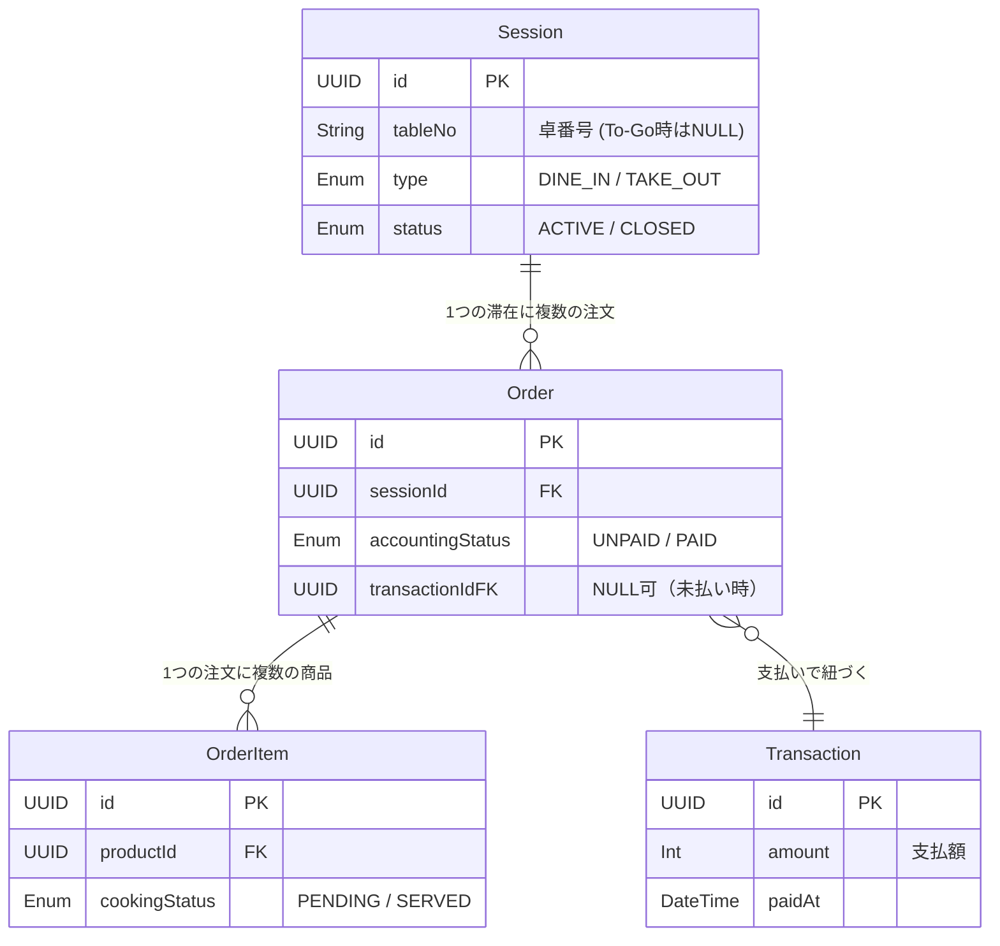

# 飲食店形式対応仕様書

**作成日:** 2026年2月17日
**版数:** 1.0 (Finalized)

---

## 1. コンセプトとデータ構造

屋台形式（To-Go）と飲食店形式（Dine-in）を統一的に扱うため、「滞在 (Session)」と「注文 (Order)」を分離した3層構造を採用する。

### 1.1 3層データモデル

| 層 | エンティティ | 説明 | 役割 |
| :--- | :--- | :--- | :--- |
| **L1** | **Session** (来店/滞在) | 1組の客の「入店から退店まで」を管理する一意のID。 | 卓番、人数、入店時間を保持。 屋台モードでも一瞬のSessionとして生成される。 |
| **L2** | **Order** (注文) | 「すいません、これください」単位の注文束。 1つのSessionに複数紐づく。 | **会計ステータス (Accounting Status)** を管理。 「これは支払い済みか？」を判断する単位。 |
| **L3** | **OrderItem** (商品明細) | 実際に注文された商品個々。 1つのOrderに複数紐づく。 | **調理ステータス (Cooking Status)** を管理。 「これは調理済みか？」を判断する単位。 |

### 1.2 ステータス定義 (Dual Status)

「金銭のやり取り」と「調理の進行」を完全に独立して管理する。

*   **Accounting Status (Order単位)**
    *   `UNPAID`: 未払い（後払い待ち）
    *   `PAID`: 支払い済み（先払い完了、または食後会計完了）
    *   `CANCELED`: 注文取り消し
*   **Cooking Status (OrderItem単位)**
    *   `PENDING`: キッチン未着手（調理待ち）
    *   `COOKING`: 調理中
    *   `SERVED`: 提供済み（配膳完了 / 呼び出し完了）
    *   `CANCELED`: 調理キャンセル

---

## 2. 運用モードとフロー

同一のデータモデルを使用し、ステータスの遷移タイミングを変えることで2つのモードに対応する。

### 2.1 レストランモード (Dine-in)
*   **特徴**: Sessionが長時間維持され、複数のOrderが紐づく。支払いは任意のタイミング（都度/最後）で可能。
*   **Session終了条件**: **マニュアル操作のみ**。
    *   全てのオーダーが提供・会計済みであっても、客が食事中である可能性があるため、自動では閉じない。
    *   退店時にスタッフが明示的に「Check Out」を行うことで `CLOSED` とする。

| 手順 | アクション | データ遷移 |
| :--- | :--- | :--- |
| 1. 入店 | スタッフが卓番入力 | **Session作成** (`ACTIVE`) |
| 2. 注文 | ハンディ/スマホで注文 | **Order作成** (`UNPAID`) -> **OrderItem作成** (`PENDING`) |
| 3. 調理 | キッチンで確認・調理 | OrderItem: `PENDING` -> `COOKING` -> `SERVED` |
| 4. 会計 | レジで卓番選択・支払い | Order: `UNPAID` -> **Transaction作成** -> `PAID` |
| 5. 退店 | スタッフが退店処理 | Session: `CLOSED` |

### 2.2 屋台モード (To-Go)
*   **特徴**: 注文・会計は一括だが、提供（呼び出し）までをSessionとして管理する。**後払い（受け取り時会計）も可能**。
*   **Session終了条件**: **自動完了**。
    *   条件: 紐づく全てのOrderが `Accounting: PAID` かつ、全てのOrderItemが `Cooking: SERVED` になった瞬間。

**パターンA: 先払い (Pre-pay)**
| 手順 | アクション | データ遷移 |
| :--- | :--- | :--- |
| 1. 受付 | レジで注文入力 | **Session作成** -> **Order作成** (`UNPAID`) |
| 2. 会計 | 即座に支払い | **Transaction作成** -> Order: `PAID` |
| 3. 調理 | キッチン/引換券で確認 | OrderItem: `PENDING` -> `SERVED` (提供/呼出完了) |
| 4. 完了 | 提供完了により自動クローズ | **Session: CLOSED** (All Paid & Served) |

**パターンB: 後払い (Post-pay)**
| 手順 | アクション | データ遷移 |
| :--- | :--- | :--- |
| 1. 受付 | レジで注文入力・**引換券**渡し | **Session作成** -> **Order作成** (`UNPAID`) |
| 2. 調理 | キッチンで確認 | OrderItem: `PENDING` -> `SERVED` (呼出) |
| 3. 会計 | 受け取り時に支払い | **Transaction作成** -> Order: `PAID` |
| 4. 完了 | 支払完了により自動クローズ | **Session: CLOSED** (All Paid & Served) |

### 2.3 ハイブリッド運用 (混在対応)

1つの店舗で「店内飲食 (Dine-in)」と「持ち帰り (To-Go)」が混在する場合、**Session作成時**に種別を選択することで対応する。

*   **運用フロー**:
    1.  スタッフがPOSで「新規客」ボタンを押す。
    2.  モード選択ポップアップ: **[ 店内 (Table) ]** / **[ お持ち帰り (To-Go) ]**
    3.  **店内選択時**: 卓番入力へ進む -> レストランモードのフロー開始。
    4.  **持ち帰り選択時**: そのまま注文画面へ進む -> 屋台モードのフロー（即時会計）開始。

*   **データ扱い**:
    *   `Session` に `type: DINE_IN | TAKE_OUT` を持たせる。
    *   KDS (キッチン) 上では、「Take-out」の注文にはアイコンを表示し、梱包が必要であることを調理スタッフに伝える。

---

## 3. 機能要件

### 3.1 ハンディターミナル (Staff Mobile)
*   **卓番管理**: 空席/満席の確認、新規Sessionの開始。
*   **注文入力**: カテゴリ選択 -> 商品選択 -> 数量指定 -> 送信。
*   **送信確認**: 「未送信リスト」を経由し、誤送信を防止。

### 3.2 キッチンディスプレイ (KDS)
*   **オーダー表示**: `Accounting: PAID` または `Restaurant Mode` の `OrderItem` を到着順に表示。
*   **ステータス更新**: タップで `PENDING` -> `SERVED` へ変更（消込）。
*   **フィルタ**: 「ドリンクのみ」「フードのみ」等の表示フィルタ。

### 3.3 レジ (POS)
*   **テーブル会計機能**: 卓番を選択し、そのSession内の `Accounting: UNPAID` なOrderを合算して会計する。
*   **先払い対応**: 飲食中のテーブルでも、特定のOrderだけを選択して先に会計(`PAID`)することができる。
*   **退店処理**: 全てのOrderが `PAID` になった時点で Session を `CLOSED` にする。

### 3.4 モバイルオーダー (Self Order)
*   **QR認証**: Session IDを含んだQRコードを読み取り、注文画面を開く。
*   **注文制限**: 売り切れ商品の非表示。送信後の変更不可（スタッフ呼び出し）。

---

## 4. 重要ルールと制約

### 4.1 混在時の割引ルール
「先払い」と「後払い」が混在する場合、会計の整合性を保つため以下のルールを適用する。

*   **ルール**: **割引は「その時点の決済 (Transaction)」にのみ適用される。**
*   **解説**: 過去に先払いしたOrder（既に `Transaction` が確定済）に対して、後から退店時の会計で割引を遡及適用することは**不可**とする。
*   **運用**: 「セット割引」等は、同時会計時のOrder内でのみ有効とする。

### 4.2 オフライン時の動作
また、レストランモードは「注文」と「調理」が物理的に離れた場所で行われるため、**ネットワーク接続が必須**である。
*   **制約**: 通信断絶時、ハンディ・KDSは使用不可となる。
*   **BCP**: オフライン時は紙伝票と手計算による運用へ切り替えるマニュアルを整備する。

---

## 5. データモデル概要 (ER図)

